# **RoboDesk V3 — Technical Reference Manual**

> **Author:** Auto-generated from codebase analysis **Last Updated:** April 14, 2026 **For:** Abdelrahman Mohamed — Onboarding Reference
> 

---

## **Table of Contents**

1. System Overview
2. High-Level Architecture
3. Directory Structure
4. Application Bootstrap
5. Layer-by-Layer Breakdown
6. Channel Adapters
7. Middleware Pipeline
8. Dependency Injection
9. Factory Pattern & Strategies
10. Auto-Distribution Engine (ACD)
11. Trigger & Action Commander
12. Service Mesh & EventHub
13. AI, NLP & Chatbot Engine
14. Error Handling System
15. Feature Modules Reference
16. Data Flow: End-to-End Request Lifecycle
17. Key Global Variables
18. Tech Stack Summary

---

## **1. System Overview**

**RoboDesk V3** is an AI-Powered Interaction Management System (IMS) / Contact Center Platform. It enables organizations to manage customer interactions across **39 different channel adapters** (WhatsApp, Facebook, Instagram, Email, SIP/Voice, Telegram, LinkedIn, SMS, and more) through a unified backend.

The platform handles:

- Omnichannel message routing
- Intelligent agent auto-distribution
- Support ticketing
- Quality control & agent scoring
- Workforce management (shifts, attendance)
- AI chatbot automation
- Custom trigger/action workflows
- Billing & subscription management

---

## **2. High-Level Architecture**

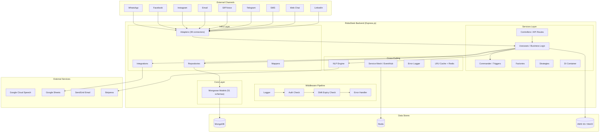

---

## **3. Directory Structure**

```
RoboDesk-V3-main/
│
├── main.js                  ← 🚀 Application entry point (bootstrap)
├── index.js                 ← Secondary entry / exports
├── package.json             ← Dependencies & scripts
├── .env                     ← Environment config (DB, Redis, keys)
├── gulpfile.js              ← Legacy frontend build (no longer used)
│
├── Core/                    ← 📦 DATABASE LAYER (Mongoose Schemas)
│   ├── user.js              ← User/Agent model
│   ├── conversation.js      ← Conversation model
│   ├── message.js           ← Message model
│   ├── supportTicket.js     ← Support ticket model
│   ├── contact.js           ← Customer contact model
│   ├── settings.js          ← Platform settings model
│   └── ... (51 schema files)
│
├── Services/                ← 🧠 BUSINESS LOGIC LAYER
│   ├── Controllers/         ← API route handlers (50 files)
│   │   ├── user.js          ← /api/user endpoints
│   │   ├── conversation.js  ← /api/conversation endpoints (47KB!)
│   │   ├── billing.js       ← /api/billing endpoints
│   │   └── ...
│   │
│   ├── Usecases/            ← Core business logic (66 files)
│   │   ├── conversation.js  ← Conversation logic (310KB — largest file!)
│   │   ├── control.js       ← Central control hub (136KB)
│   │   ├── actions.js       ← Action execution engine (271KB)
│   │   ├── autoDistribution.js  ← Chat routing (ACD)
│   │   ├── autoDistributionTicket.js ← Ticket routing
│   │   ├── forceLogoutManager.js ← Agent session management
│   │   └── ...
│   │
│   ├── Commander/           ← Trigger/Action workflow engine
│   │   └── triggerActionCommander.js
│   │
│   ├── DI/                  ← Dependency Injection container
│   │   ├── DIContainer.js   ← Generic IoC container
│   │   └── DIMap.js         ← Service registration map
│   │
│   ├── Factories/           ← Factory Method pattern
│   │   ├── Abstracts/       ← Abstract interfaces
│   │   ├── Concretes/       ← Concrete implementations
│   │   └── Creators/        ← Factory creator classes
│   │
│   ├── strategies/          ← Strategy pattern implementations
│   ├── event-emitters/      ← Event system & middlewares
│   │   ├── appEventEmitter.js
│   │   └── middlewares/
│   │       ├── check-auth.js       ← JWT auth + version check
│   │       ├── check-shift-expiry.js
│   │       ├── logger.js
│   │       ├── errorHandler.js
│   │       └── with-permissions.js
│   │
│   ├── service-mesh/        ← Inter-service communication
│   │   ├── service-consumer/ ← Redis pub/sub consumers
│   │   │   ├── EventHub.js
│   │   │   ├── lab-system-consumer.js
│   │   │   └── scan-system-consumer.js
│   │   └── message-queue-providers/
│   │
│   ├── nlp/                 ← NLP/Chatbot engines
│   │   ├── botpress-nlp.js
│   │   ├── faq-nlp.js
│   │   └── lg-stock-nlp.js
│   │
│   ├── enums/               ← Constant definitions
│   ├── lib/                 ← Error handling utilities
│   └── utils/               ← Shared utility functions
│
├── Infra/                   ← 🔌 INFRASTRUCTURE LAYER
│   ├── Adapters/            ← Channel connectors (39 adapters!)
│   ├── Reposatories/        ← Data access layer (49 files)
│   ├── Config/              ← Configuration files
│   ├── Interfaces/          ← TypeScript-style interface contracts
│   ├── Mappers/             ← Data transformation mappers
│   ├── DataStores/          ← Storage abstractions
│   ├── integrations/        ← Third-party integrations
│   │   ├── googleSheet.js
│   │   ├── shopifyIntegration.js
│   │   └── ...
│   ├── lib/                 ← Infra utilities
│   ├── utils/               ← Infra-specific helpers
│   ├── web/                 ← Legacy compiled frontend (served statically)
│   └── dist/                ← Production frontend build
│
├── Genie/                   ← 🤖 Bot/AI microservice (Dockerized)
│   ├── Dockerfile
│   └── rootfs/
│
├── k8s-deployment/          ← Kubernetes manifests
└── k8s-gcp-deployment/      ← GCP-specific K8s config
```

---

## **4. Application Bootstrap**

The `main.js` file orchestrates the entire startup sequence. Here's what happens when you run `npm start`:

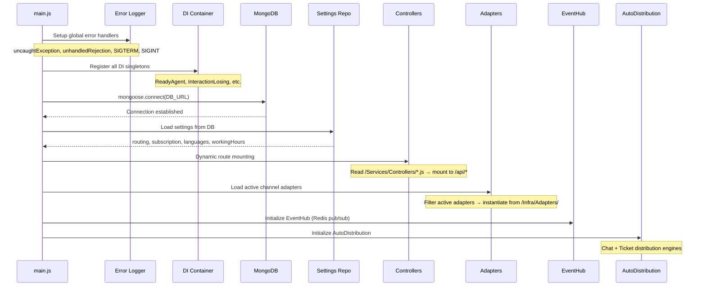

### **Key Bootstrap Steps (main.js):**

1. **Lines 1-91:** Global error handling & process signal handlers
2. **Lines 92-124:** Load environment, configure Express, initialize DI
3. **Lines 130-131:** Dynamic controller route discovery
4. **Lines 157-167:** MongoDB connection
5. **Lines 170-181:** Load platform settings into `global.settings`
6. **Lines 183-184:** Mount all API controllers dynamically
7. **Lines 196-213:** Instantiate active channel adapters
8. **Lines 218-230:** Start EventHub, AutoDistribution, ForceLogoutManager

---

## **5. Layer-by-Layer Breakdown**

The codebase follows a **layered architecture** with clear separation of concerns:

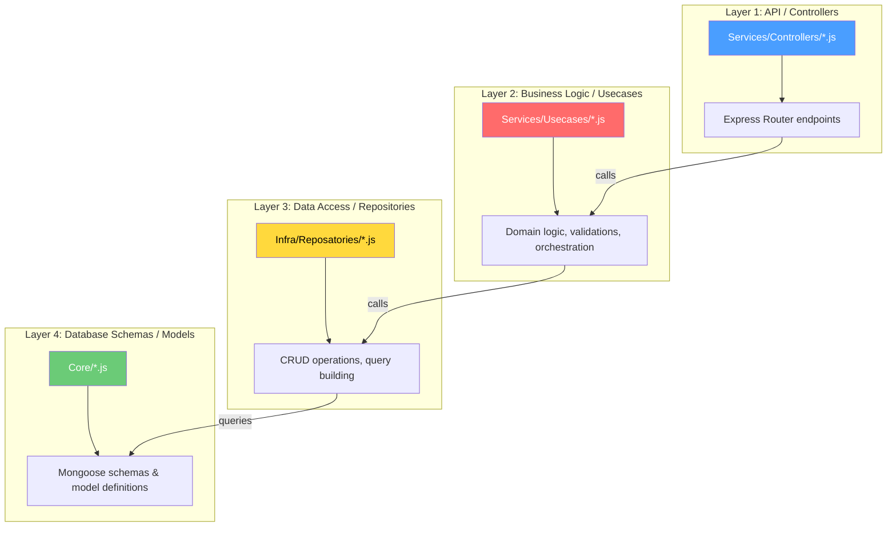

> [!IMPORTANT] **The Golden Rule:** Controllers should NEVER directly access Repositories or Models. The flow must always be: `Controller → Usecase → Repository → Model`. This keeps business logic testable and decoupled.
> 

### **How a typical module is structured (example: `billing`):**

| Layer | File | Responsibility |
| --- | --- | --- |
| **Controller** | `Services/Controllers/billing.js` | Defines `/api/billing` routes, parses HTTP request |
| **Usecase** | `Services/Usecases/billing.js` | Business logic: calculate billing, check suspension |
| **Repository** | `Infra/Reposatories/invoice.js` | MongoDB CRUD for invoice documents |
| **Model** | `Core/invoice.js` | Mongoose schema defining invoice fields |

---

## **6. Channel Adapters**

The adapter system is the heart of RoboDesk's omnichannel capability. Each adapter is a self-contained class that knows how to:

1. **Receive** incoming messages/webhooks from a channel
2. **Normalize** the data into RoboDesk's internal conversation format
3. **Send** outbound messages back through the channel

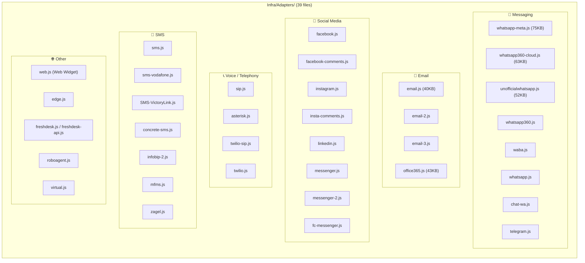

### **How an adapter loads at startup:**

1. `main.js` queries the database for all adapters with `mode == "active"`
2. For each active adapter, it dynamically `require()` the matching file from `Infra/Adapters/`
3. The adapter class is instantiated with the Express `app`, `server`, and its channel-specific config
4. The adapter registers its own webhook routes (e.g., `/services/whatsapp-meta/webhook`)
5. The adapter instance is stored in `global.adapters[adapterName]`

---

## **7. Middleware Pipeline**

Every HTTP request hitting the Express server passes through these middlewares **in order**, defined in `main.js`:

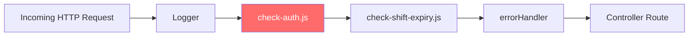

| Middleware | File | Purpose |
| --- | --- | --- |
| **Logger** | `middlewares/logger.js` | Logs request method, URL, IP, user, body, and duration |
| **Auth Check** | `middlewares/check-auth.js` | JWT verification, token refresh, API version validation, billing suspension check, role-based access control |
| **Shift Expiry** | `middlewares/check-shift-expiry.js` | Checks if the agent's shift has expired and blocks actions if so |
| **Error Handler** | `middlewares/errorHandler.js` | Global Express error handler |
| **Permissions** | `middlewares/with-permissions.js` | Fine-grained permission decorator for specific routes |
| **Response Transform** | `middlewares/ResponseTransformInterceptor.js` | Standardizes API response format |

> [!WARNING] The `check-auth.js` middleware (327 lines) is the most critical file in the entire request pipeline. It handles JWT tokens, token refresh via compressed cookies (AdmZip), Base64 basic auth, role-based access, and the API version check that was blocking your login.
> 

---

## **8. Dependency Injection**

RoboDesk implements a custom **IoC (Inversion of Control) container** to manage service dependencies.

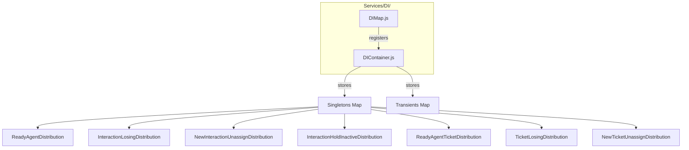

### **How it works:**

**`DIContainer.js`** — A generic container stored as a global singleton:

- `registerSingleton(name, class)` — Instantiates once, reuses forever
- `registerTransient(name, class)` — Creates a new instance on every `resolve()`
- `resolve(name)` — Retrieves the registered service

**`DIMap.js`** — Registers all auto-distribution strategies at startup:

- Maps enum keys (like `DISTRIBUTION_TYPES.ReadyAgent`) to concrete implementations
- Called once during bootstrap in `main.js` line 123: `new DIMap().register()`

---

## **9. Factory Pattern & Strategies**

The codebase heavily uses the **Factory Method** and **Strategy** design patterns for pluggable behavior.

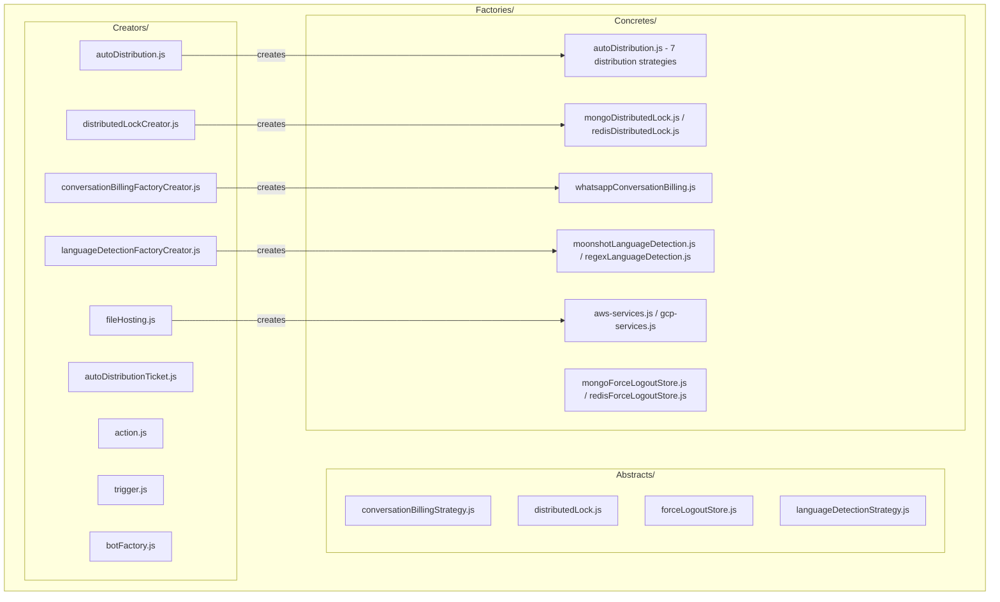

### **Key Factory Decisions:**

| Factory Creator | What It Decides |
| --- | --- |
| `autoDistribution.js` | Which routing algorithm to use for chat distribution |
| `autoDistributionTicket.js` | Which routing algorithm to use for ticket distribution |
| `fileHosting.js` | Upload files to **AWS S3** vs **GCP Cloud Storage** |
| `distributedLockCreator.js` | Use **MongoDB** vs **Redis** for distributed locks |
| `forceLogoutStoreCreator.js` | Store logout schedules in **MongoDB** vs **Redis** |
| `languageDetectionFactoryCreator.js` | Detect language via **Moonshot AI** vs **Regex** |
| `botFactory.js` | Which chatbot engine to use |

---

## **10. Auto-Distribution Engine (ACD)**

The Automatic Call/Chat Distribution engine is the core of any contact center and one of the most complex subsystems in RoboDesk.

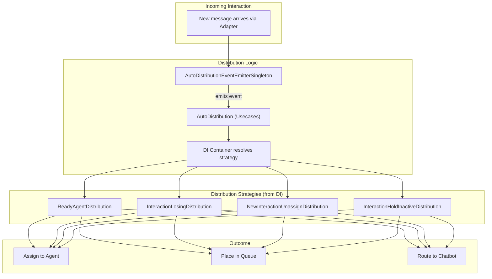

### **Distribution Types (from `enums/autoDistribution.js`):**

| Strategy | When It Fires |
| --- | --- |
| **ReadyAgent** | A new interaction arrives — find the best available agent |
| **InteractionLosing** | An agent goes offline — redistribute their open chats |
| **NewInteractionUnassign** | An unassigned interaction needs to be picked up |
| **InteractionHoldInactive** | An interaction has been on hold too long |
| **ReadyAgentTicket** | Same as ReadyAgent but for support tickets |
| **TicketLosing** | Redistribute tickets from an offline agent |
| **NewTicketUnassign** | Unassigned ticket needs pickup |

---

## **11. Trigger & Action Commander**

The Commander is a custom **rules engine** that allows administrators to define automated workflows.

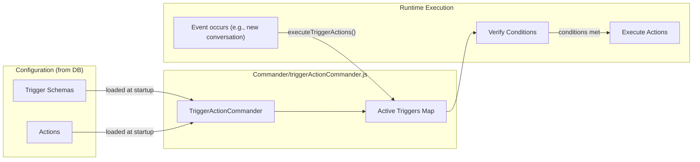

### **How it works:**

1. At startup, `main.js` loads all trigger schemas and actions from the database
2. `triggerActionCommander` builds a Map of active triggers, each with a list of associated actions
3. When an event occurs (e.g., new conversation created), code calls `executeTriggerActions(triggerName, conversation, user)`
4. The commander finds the trigger, loops through its actions, verifies each action's conditions, and executes the ones that match

---

## **12. Service Mesh & EventHub**

The **EventHub** provides Redis-based pub/sub communication, acting as a lightweight message bus within the monolith.

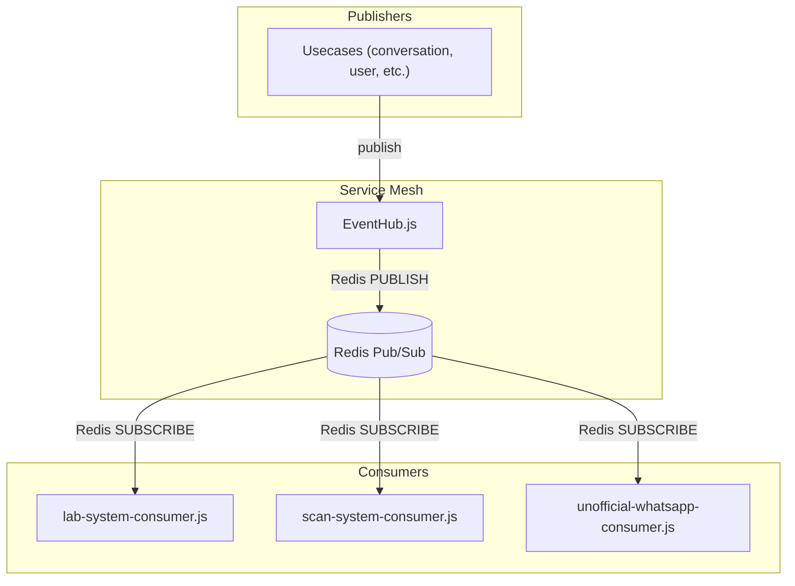

### **Key Consumers:**

| Consumer | Purpose |
| --- | --- |
| `lab-system-consumer.js` | Listens for lab result events and processes them |
| `scan-system-consumer.js` | Handles document scanning events |
| `unofficial-whatsapp-consumer.js` | Manages unofficial WhatsApp session events |

---

## **13. AI, NLP & Chatbot Engine**

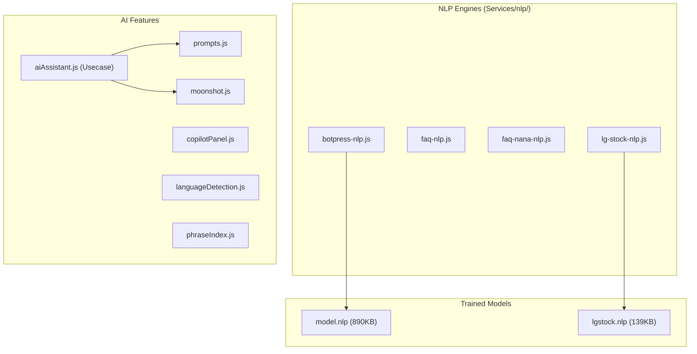

### **AI Capabilities:**

- **NLP Classification:** Uses `node-nlp` with pre-trained `.nlp` model files for intent classification and FAQ matching
- **Botpress Integration:** Connects to Botpress for more complex chatbot dialogue flows
- **AI Assistant:** Agent-facing AI copilot that suggests responses (`aiAssistant.js`)
- **Language Detection:** Automatically detects customer language via Moonshot AI or regex patterns
- **Phrase Indexing:** Builds searchable indexes of conversation phrases for analysis

---

## **14. Error Handling System**

RoboDesk has a sophisticated error handling pipeline located in `Services/lib/`:

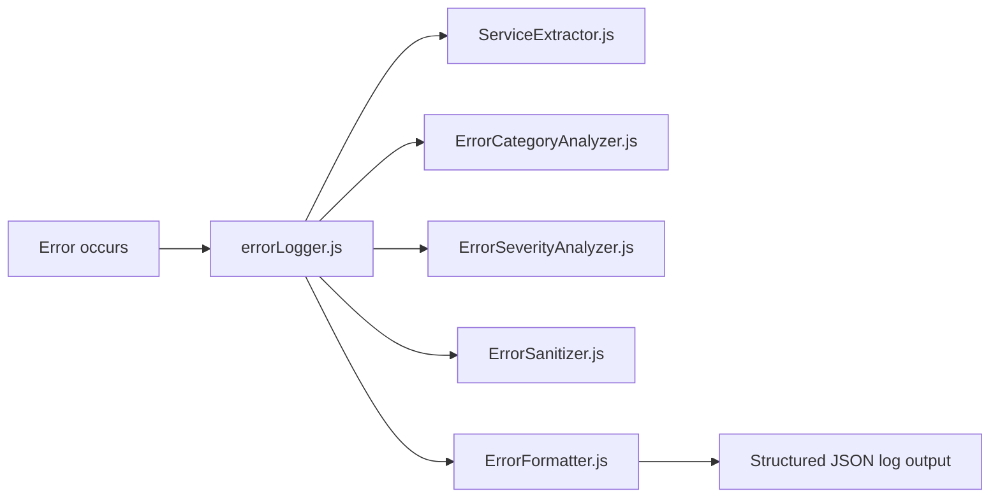

| Component | Responsibility |
| --- | --- |
| `errorLogger.js` | Central logging facade — handles uncaught exceptions, rejections, warnings |
| `ErrorCategoryAnalyzer.js` | Classifies errors (AUTHENTICATION, DATABASE, NETWORK, etc.) |
| `ErrorSeverityAnalyzer.js` | Assigns severity levels (LOW, MEDIUM, HIGH, CRITICAL) |
| `ErrorSanitizer.js` | Strips sensitive data (passwords, tokens) from error logs |
| `ErrorFormatter.js` | Formats errors into structured JSON with unique IDs and hashes |
| `ServiceExtractor.js` | Determines which service/module the error originated from |

---

## **15. Feature Modules Reference**

| Module | Controller | Usecase | Repository | Model |
| --- | --- | --- | --- | --- |
| **Conversations** | `conversation.js` (47KB) | `conversation.js` (310KB) | `conversation.js` (58KB) | `conversation.js` (11KB) |
| **Users/Agents** | `user.js` (11KB) | `user.js` (59KB) | `user.js` (9KB) | `user.js` (6KB) |
| **Support Tickets** | `support.tickets.js` | `support.tickets.js` | `support.tickets.js` | `supportTicket.js` |
| **Form Tickets** | `form.tickets.js` (12KB) | `form.tickets.js` (135KB) | `form.tickets.js` (24KB) | — |
| **Contacts** | `contact.js` (5KB) | `contact.js` (19KB) | `contact.js` (6KB) | `contact.js` (2KB) |
| **Quality Control** | `qualityControl.js` | `qualityControl.js` (22KB) | `qualityControl.js` (7KB) | `qualityControl.js` |
| **Shift Management** | `shiftmgt.js` (3KB) | `shiftmgt.js` (22KB) | `shiftmgt.js` (3KB) | `shiftmgt.js` |
| **Attendance** | `attendance.js` | `attendance.js` (6KB) | `attendance.js` (8KB) | `attendance.js` |
| **Billing** | `billing.js` | `billing.js` (5KB) | `invoice.js` | `invoice.js` |
| **Insights** | `insight.js` (23KB) | `insight.js` (39KB) | — | — |
| **Settings** | `settings.js` (4KB) | `settings.js` (30KB) | `settings.js` | `settings.js` (23KB) |
| **Articles/KB** | `article.js` (7KB) | `article.js` (24KB) | `article.js` (11KB) | `article.js` |
| **Procedures** | `procedure.js` (8KB) | `procedure.js` (11KB) | `procedure.js` (7KB) | `procedure.js` |
| **Notifications** | `notifications.js` | `notification.js` (10KB) | `notifications.js` | `notifications.js` |
| **Prompts (AI)** | `prompts.js` (3KB) | `prompts.js` (10KB) | — | — |
| **OAuth** | `oauth.js` (3KB) | `oauth.js` (5KB) | — | — |

> [!TIP] The **conversation module** is by far the largest and most complex. `Services/Usecases/conversation.js` alone is **310KB** (roughly 8,000+ lines). When working on conversation-related features, expect to spend significant time understanding this file.
> 

---

## **16. Data Flow: End-to-End Request Lifecycle**

### **Scenario: Customer sends a WhatsApp message**

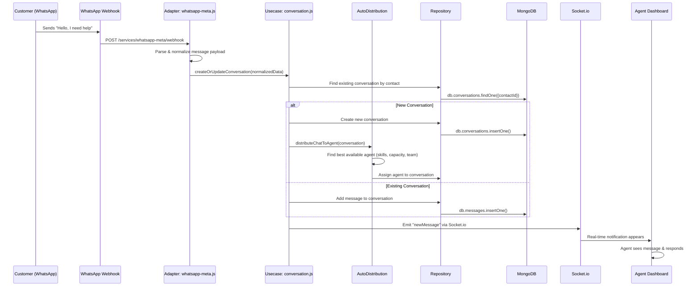

### **Scenario: Agent sends a reply**

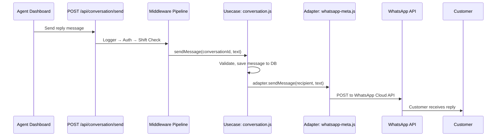

---

## **17. Key Global Variables**

RoboDesk uses `global` extensively to share state across the monolith. Here are the critical ones:

| Variable | Set In | Contains |
| --- | --- | --- |
| `global.settings` | `main.js` | General platform settings from DB |
| `global.settingsRouting` | `main.js` | Routing config (max convs per agent, etc.) |
| `global.settingsSubscription` | `main.js` | Subscription/plan info |
| `global.settingsChannels` | `main.js` | All channel adapter configurations |
| `global.languages` | `main.js` | Supported languages |
| `global.workingHours` | `main.js` | Business hours configuration |
| `global.sandbox` | `main.js` | Sandbox/testing mode settings |
| `global.adapters` | `main.js` | Map of active adapter instances |
| `global.from` | `main.js` | Map of adapter name → identifier |
| `global.cache` | `main.js` | LRU Cache instance (max 500 items) |
| `global.mongooseInstance` | `main.js` | Mongoose connection instance |
| `global.triggerActionCommander` | `main.js` | The trigger/action rules engine |
| `global.eventHub` | `main.js` | Redis EventHub instance |
| `global.accessUrls` | `check-auth.js` | Cached list of access control URLs |
| `global.dependencyContainerInstance` | `DIContainer.js` | The DI container singleton |
| `global.applicationMetadataReference` | `main.js` | References to `app` and `server` |

---

## **18. Tech Stack Summary**

| Category | Technology | Version/Notes |
| --- | --- | --- |
| **Runtime** | Node.js | v10.16.3 (declared) / v14-22 (actually required) |
| **Framework** | Express.js | v4.17 |
| **Database** | MongoDB | via Mongoose v5.10 |
| **Cache** | Redis | v4.2, LRU Cache v10 |
| **Real-time** | Socket.io | v2.0 |
| **Auth** | JWT | jsonwebtoken + express-jwt |
| **Telephony** | Asterisk AMI, SIP.js, JsSIP, Twilio | Multiple VoIP integrations |
| **AI/NLP** | node-nlp, Botpress | Local models + cloud bots |
| **Cloud** | AWS S3, GCP Speech, Google Sheets API | Multi-cloud |
| **Email** | Nodemailer, SendGrid, Office 365 | IMAP + SMTP |
| **Messaging** | WhatsApp (Meta, 360dialog, unofficial), Telegram, Facebook, Instagram | Multiple providers |
| **Build** | Gulp (legacy, unused) | AngularJS frontend bundler |
| **Deploy** | Docker, Kubernetes | K8s manifests for GCP |
| **Dev Tools** | Nodemon, Puppeteer | Hot-reload, browser automation |

---

> [!NOTE] This document is a living reference. As you explore deeper into specific modules, you can ask me to expand any section with more detail, code examples, or additional diagrams.
>

---

### Attached Media


.png)
