# System Architecture

This document describes the architectural layout of the **Documentation Portal** website. The portal utilizes Next.js App Router to enable both fast server rendering of static text and dynamic client-side hydration of interactive widgets like Mermaid.

## 🏗️ Architecture Design

Here is the system flow showing how editing and rendering interact:

```mermaid
graph TD
    subgraph Client [Browser Client]
        UI[User Interface]
        Render[Markdown Renderer]
        Editor[Split Editor]
        Mermaid[Mermaid Parser]
    end

    subgraph Server [Next.js Server API]
        API_GET[GET Route]
        API_PUT[PUT Route]
        API_POST[POST Route]
    end

    subgraph Data [Storage]
        MD_FILES[(Markdown Files on Disk)]
    end

    UI -->|Navigate| API_GET
    API_GET -->|Read| MD_FILES
    MD_FILES -->|Markdown Content| Render
    Render -->|Render Custom Code Blocks| Mermaid
    
    UI -->|Edit Page| Editor
    Editor -->|Live preview| Render
    Editor -->|Click Save| API_PUT
    API_PUT -->|Write File| MD_FILES
```

## 📂 File Layout

The codebase has the following directory structure:

* `/docs/` - Contains all markdown files (.md) categorized by folder structure or frontmatter.
* `/components/` - Key UI controls including Sidebar, MarkdownRenderer, and CodeEditor.
* `/app/api/` - Folder operations (create, update, read, delete docs).
* `/app/` - Layouts, theme setup, and route handlers.

---

## 💾 Core API Endpoint Specifications

### 1. Get List of Files
`GET /api/docs`  
Returns a hierarchical list of all categories and files.

### 2. Update File Content
`PUT /api/docs/[...slug]`  
Saves the edited file content directly back to the workspace directory.
