**Inbound & Outbound Deep Dive — WhatsApp Meta Edition**

A detailed walkthrough of how messages flow through RoboDesk V3, using the **`whatsapp-meta.js`** adapter and **`control.js`** as the primary examples.

---

<video controls width="100%" style="border-radius: 8px; margin-top: 1rem;">
  <source src="/assets/4-Inpound&Outpound_RoboDesk_V3_Message_Path.mp4" type="video/mp4" />
  Your browser does not support the video tag.
</video>

### 1. The Big Picture

Every interaction in RoboDesk flows through a three-layer sandwich:

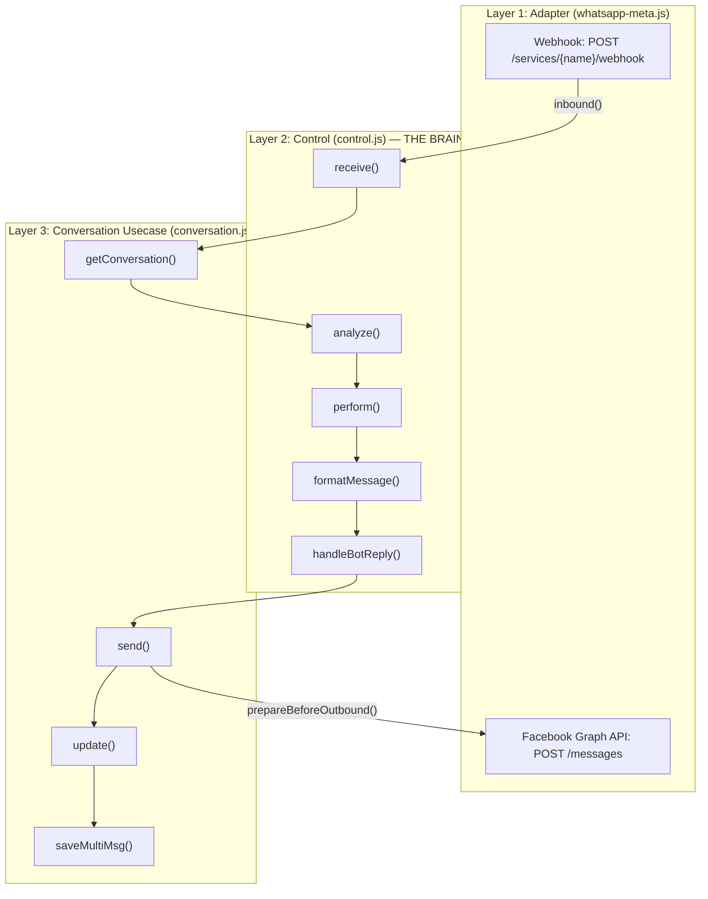

**IMPORTANT:**  **control.js is a global singleton.** Line 79-83: if **`global.control`** already exists, the constructor returns it. There is only ever ONE instance of Control alive in the entire application. This is critical — every adapter (WhatsApp, Facebook, Telegram, etc.) calls the SAME **`control.receive()`** method.

---

### 2. Inbound Flow: Customer → RoboDesk

This is the complete journey of a customer message from WhatsApp to the agent's dashboard.

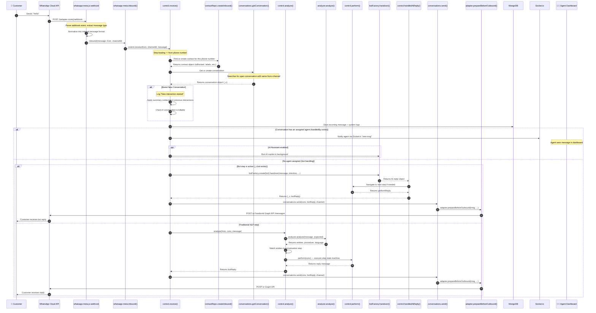

**What happens at each numbered step:**

| **#** | **Method** | **File** | **What It Does** |
| --- | --- | --- | --- |
| 1-4 | Webhook handler | **`whatsapp-meta.js:86`** | Meta sends POST with webhook event payload |
| 5 | **`inbound()`** | **`whatsapp-meta.js:597`** | One-liner: calls **`control.receive()`** |
| 6 | **`receive()`** | **`control.js:898`** | **The entry point for ALL inbound messages from ALL adapters** |
| 7 | **`createInbound()`** | **`contact.js`** | Finds existing contact by phone or creates a new one |
| 8 | **`getConversation()`** | **`conversation.js`** | Finds open conversation or creates new one with default procedure |
| 9-10 | System logging | **`control.js:920-956`** | Creates "New interaction started" log, applies summary history |
| 11 | **`saveMultiMsg()`** | **`conversation.js`** | Batch-saves all messages to MongoDB |
| 12 | Bot/Agent routing | **`control.js:975-1041`** | **The critical decision point** — see next section |

---

### 3. Outbound Flow: RoboDesk → Customer

Outbound messages go through the adapter's **`prepareBeforeOutbound()`** → **`outbound()`** chain.

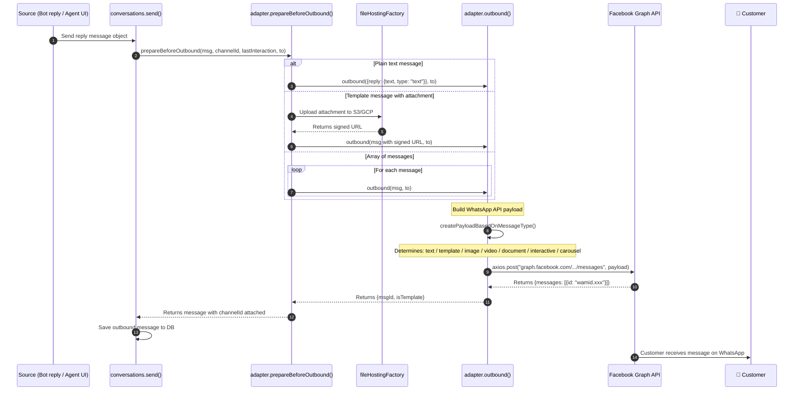

**Outbound Message Type Decision Tree**

The adapter's **`createPayloadBasedOnMessageType()`** method (line 896) determines the exact WhatsApp API payload structure:

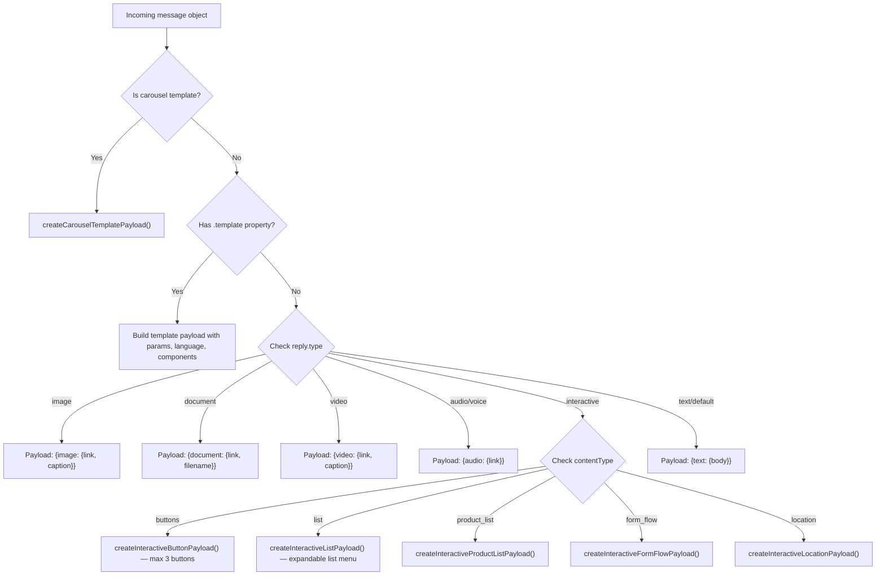

---

### 4. Deep Dive: whatsapp-meta.js Adapter

**File: `Infra/Adapters/whatsapp-meta.js` (1,568 lines, 75KB)**

This adapter connects to the **WhatsApp Cloud API** (Meta's direct API, not a third-party BSP).

**Class Structure**

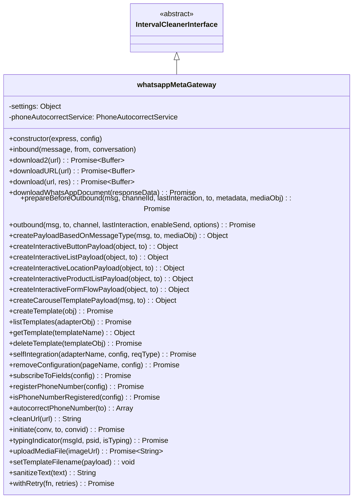

**Inbound Webhook Message Parsing (lines 166-309)**

When a customer sends a message, Meta's webhook delivers the raw payload. The adapter normalizes every message type into a standard internal format:

| **WhatsApp Type** | **Internal Type** | **Key Fields Extracted** |
| --- | --- | --- |
| **`text`** | **`text`** | **`text: body`** |
| **`interactive.button_reply`** | **`text`** | **`text: button_reply.title`** |
| **`interactive.list_reply`** | **`text`** | **`text: list_reply.title`** |
| **`interactive.nfm_reply`** | **`text`** | **`text: response_json`**, **`formData: parsed JSON`** |
| **`image`** | **`image`** | **`attachement: graph.facebook.com/{imageId}`** |
| **`video`** | **`video`** | **`attachement: graph.facebook.com/{videoId}`** |
| **`audio`** / **`voice`** | **`audio`** | **`attachement: graph.facebook.com/{audioId}`** |
| **`document`** | **`document`** | **`attachement: graph.facebook.com/{docId}`** |
| **`location`** | **`location`** | **`latitude, longitude`** |
| **`reaction`** | **`reaction`** | **`text: emoji, channelId: original_msg_id`** |
| **`button`** | **`text`** | **`text: button.text`** |
| **`sticker`** / **`contact`** | **Ignored** | **`message = null`** |

**TIP:**  All media (images, audio, documents) are NOT downloaded at this stage. Only the Facebook Graph API media ID URL is stored. The actual download happens later when needed.

**Error Code Mapping (lines 29-78)**

The adapter has a comprehensive mapping of WhatsApp Cloud API error codes to failure categories:

| **Category** | **Error Codes** | **Meaning** |
| --- | --- | --- |
| **Unreachable** | 131026, 131049, 131048, 133010, 136004 | Customer can't receive messages (blocked, not on WhatsApp, spam limit) |
| **Configuration** | 0, 3, 10, 190, 131005, 132000-132016 | Server setup error (bad token, missing template, payment issue) |
| **TimeWindow** | 131047 | 24-hour window expired — must send a template to re-engage |

---

### 5. Deep Dive: control.js — The Brain

**File: `Services/Usecases/control.js` (2,609 lines, 136KB)**

This is the **central nervous system** of the entire application. It orchestrates every message from initial receipt through NLP analysis, procedure step navigation, bot handover, and response delivery.

**Class Structure**

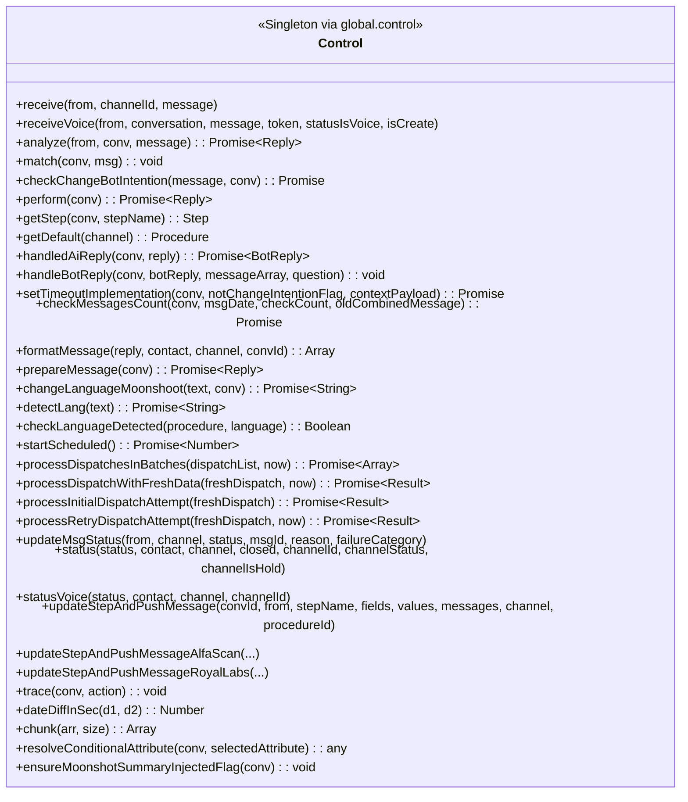

**The `receive()` Method — Step by Step (line 898)**

This is the most important method in the entire codebase. Here is exactly what happens:

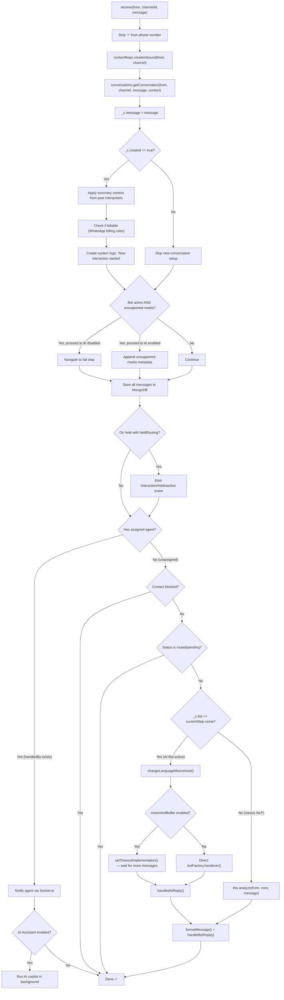

**The `perform()` Method — The Procedure State Machine (line 1183)**

This is the **step execution engine**. It's a giant **`switch`** statement that navigates through the conversation's procedure (workflow) steps. Each step has a **`type`** that determines what action to take:

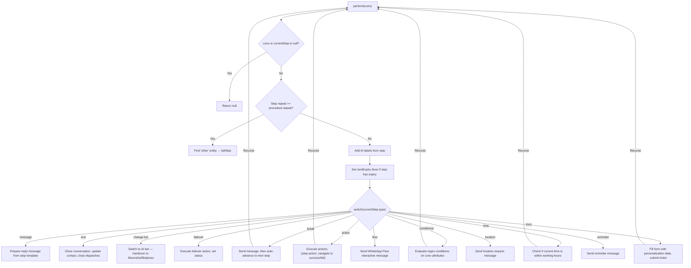

**Step Types Reference**

| **Step Type** | **What It Does** | **Recurses?** |
| --- | --- | --- |
| **`message`** | Sends a pre-configured message to the customer. Waits for input. | No |
| **`break`** | Sends a message but immediately advances to the **`next`** step without waiting. | **Yes** |
| **`end`** | Closes the conversation. Sets **`closed = true`**, **`clousureType = 'completed'`**. Updates contact's last interaction data. | No |
| **`action`** | Executes a server-side action function (e.g., call an API, query a database). Navigates to **`success`** or **`fail`** step based on result. | **Yes** |
| **`change bot`** | Hands conversation over to an AI chatbot (Moonshot, Botpress). The bot takes full control until it returns a **`close`** or **`failover`** interaction. | No (async) |
| **`conditional`** | Evaluates regex patterns against conversation attributes. Routes to matching step or **`on_failure_step`**. | **Yes** |
| **`failover`** | Executes an action and sends a message, typically used for error recovery or escalation to human agent. | No |
| **`time`** | Checks if the current time falls within configured working hours. Routes to **`success`** (in hours) or **`fail`** (off hours). | **Yes** |
| **`form`** | Fills a form/ticket using personalization data and submits it. Used for creating support tickets mid-conversation. | **Yes** |
| **`flow`** | Sends a WhatsApp Flow (interactive multi-screen form) to the customer. | No |
| **`location`** | Sends a location request to the customer. | No |
| **`reminder`** | Sends a reminder notification message. | No |

**WARNING:**  Steps that recurse (marked **Yes**) call **`perform()`** again from within **`perform()`**. This means a single customer message can trigger a chain of 5-10+ steps executing back-to-back before a reply is finally sent. Be very careful when debugging — a single **`receive()`** call can cascade through multiple steps.

---

### 6. The Procedure State Machine

A **Procedure** is a conversation workflow defined in the database. It consists of an array of **Steps**, and each step defines:

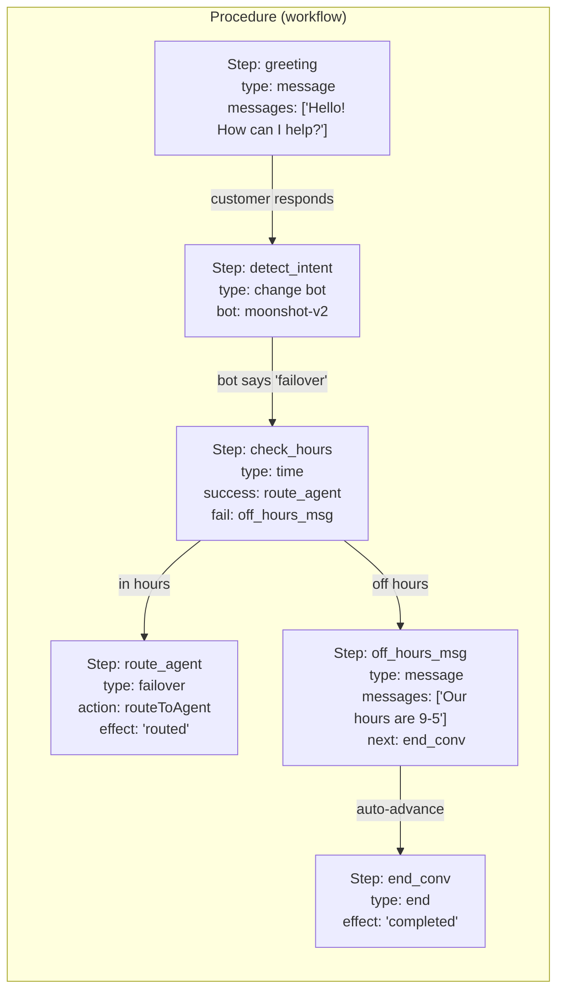

**How the system tracks position:**

- **`_conv.procedure`** — The full procedure object (loaded from DB at conversation creation)
- **`_conv.currentStep`** — A reference to the current step within **`procedure.steps[]`**
- **`_conv.personalization`** — Key-value store populated by step fields (like a form being filled)
- **`_conv.intention`** — The AI bot's current conversation flow/intent
- **`_conv.bot`** — Name of the currently active AI bot (null if classic NLP)
- **`_conv.entities`** — Array of detected NLP entities across the conversation

**`getStep(conv, stepName)`** (line 2361) is the navigation method — it simply does:

```jsx
return conv.procedure.steps.find(st => st.name == stepName);
```

---

### 7. Bot Handover & AI Pipeline

When a step of type **`change bot`** is reached, the system switches from rule-based NLP to full AI control:

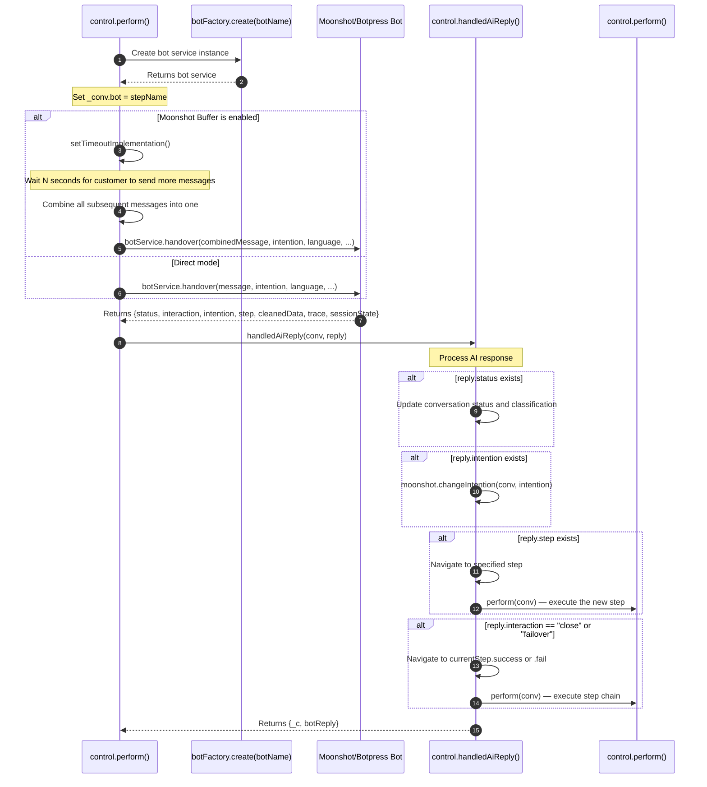

**The `moonshotBuffer` Feature**

This is a smart message-batching system. When enabled:

1. Customer sends "Hi"
2. System starts a timer (e.g., 3 seconds)
3. Customer sends "I need help with my order"
4. Timer resets
5. Customer sends "Order #12345"
6. Timer expires → All 3 messages are combined: "Hi I need help with my order Order #12345"
7. Combined message is sent to AI as a single request

This dramatically improves AI accuracy by giving it full context instead of fragmented messages.

---

### 8. Dispatch / Scheduled Outbound Campaigns

The **`startScheduled()`** system handles proactive outbound messaging (campaigns, reminders, follow-ups):

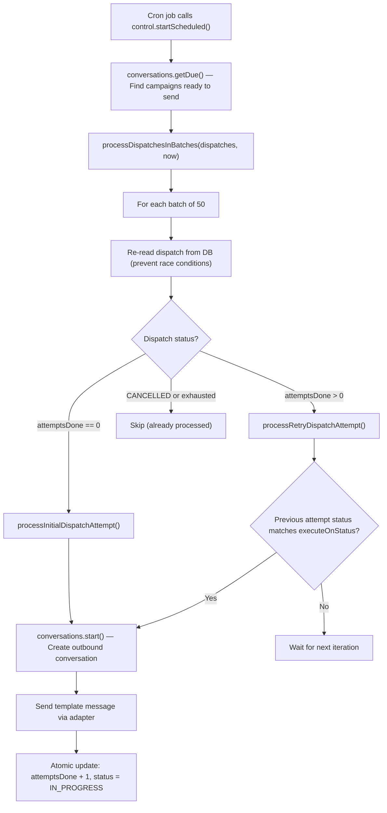

**NOTE:**  Race condition prevention is critical here. The system uses **atomic MongoDB updates** with **`{_id: dispatchId, attemptsDone: expectedValue}`** as the filter. If another process already incremented **`attemptsDone`**, the update fails silently and the dispatch is skipped. Additionally, **`retryWithBackoff()`** handles MongoDB WriteConflict errors with exponential backoff.

---

### 9. Status Webhooks & Delivery Tracking

After sending a message, WhatsApp sends status webhooks back. The adapter handles these at lines 96-163:

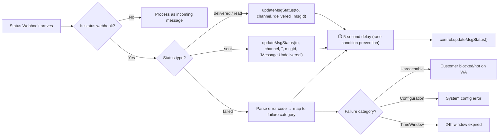

**WARNING:**  Notice the 5-second **`setTimeout()`** delay on all status webhook handlers (lines 113, 147, 157). This exists because WhatsApp often sends the delivery status webhook BEFORE RoboDesk has finished saving the outbound message's **`templateMId`** to the database. Without this delay, the status update would fail to find the matching conversation.

---

### 10. Key Method Reference Table

Quick-reference for the most important methods when debugging:

| **Method** | **File:Line** | **Purpose** |
| --- | --- | --- |
| **`receive()`** | **`control.js:898`** | **THE** entry point for all inbound messages |
| **`analyze()`** | **`control.js:1049`** | NLP analysis + entity matching + language detection |
| **`perform()`** | **`control.js:1183`** | Step state machine — executes current step type |
| **`getStep()`** | **`control.js:2361`** | Navigate to a named step in the procedure |
| **`match()`** | **`control.js:431`** | Match detected entities against expected step entities |
| **`handledAiReply()`** | **`control.js:765`** | Process AI bot response (status, intention, step changes) |
| **`handleBotReply()`** | **`control.js:579`** | Format and send bot reply to customer |
| **`formatMessage()`** | **`control.js:541`** | Convert reply objects into message array format |
| **`setTimeoutImplementation()`** | **`control.js:671`** | Message batching timer for Moonshot buffer |
| **`startScheduled()`** | **`control.js:366`** | Cron entry point for outbound campaigns |
| **`inbound()`** | **`whatsapp-meta.js:597`** | Adapter → Control bridge (calls **`control.receive()`**) |
| **`outbound()`** | **`whatsapp-meta.js:619`** | Build payload and POST to WhatsApp API |
| **`prepareBeforeOutbound()`** | **`whatsapp-meta.js:474`** | Handle attachments, templates, arrays before sending |
| **`createPayloadBasedOnMessageType()`** | **`whatsapp-meta.js:896`** | Build the exact WhatsApp API JSON payload |
| **`updateMsgStatus()`** | **`control.js`** | Update delivery/read status from webhooks |

---

**TIP:**  **Pro debugging tip:** When tracing a message through the system, search the console logs for these prefixes:

- **`RECEIVE STARTED`** — Message just arrived at **`control.receive()`**
- **`[CHANGE-BOT-START]`** — Switching to AI bot
- **`[HANDLED-AI-REPLY-START]`** — Processing AI bot's response
- **`[FAILOVER-DECISION]`** — Bot decided to escalate/close
- **`[SCHEDULE]`** — Outbound campaign processing
- **`[EXPIRY-SET]`** — Step timer configured