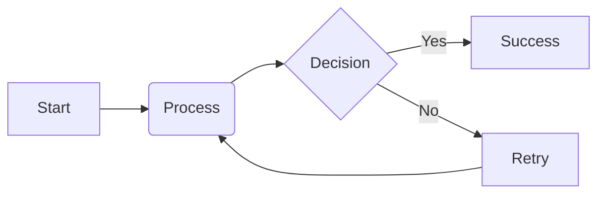
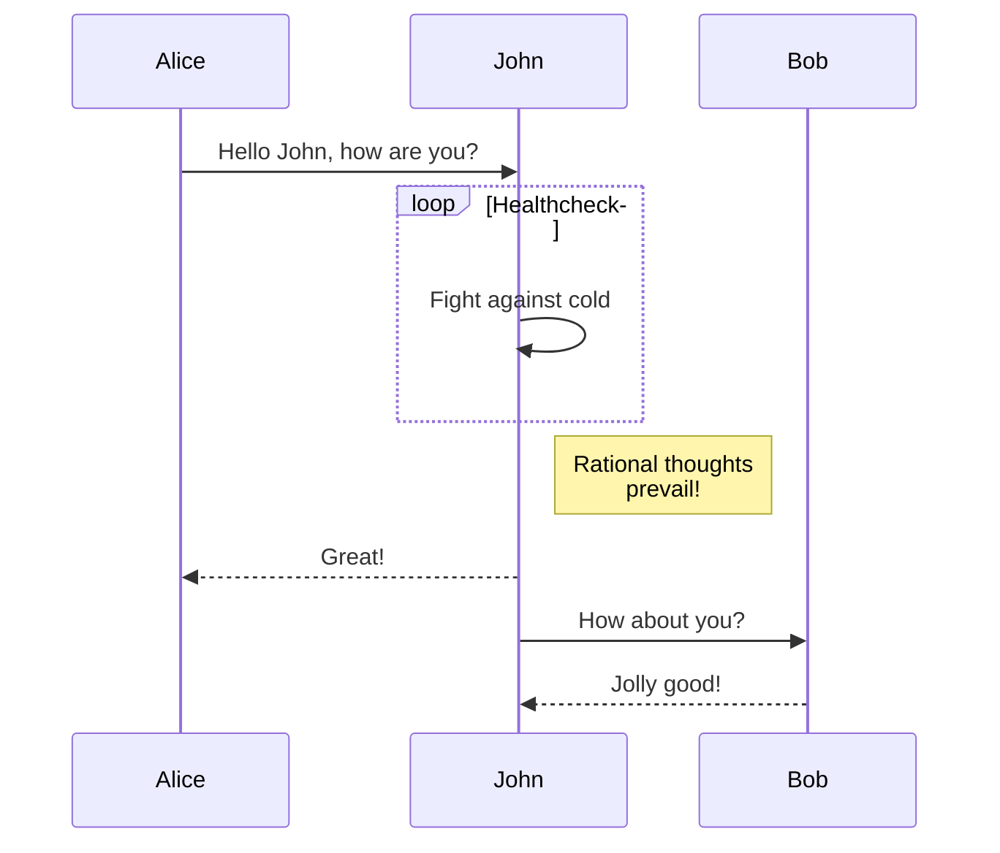
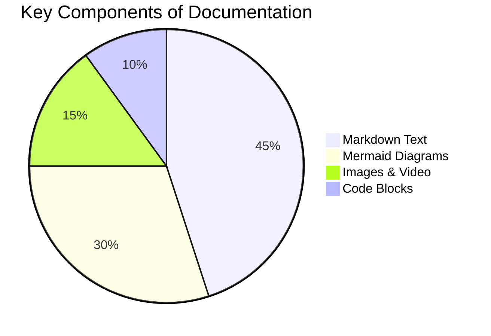

# Mermaid Diagram Guide

Mermaid lets you create diagrams and visualizations using text and code. Since all diagrams are written in simple text, they can be version-controlled in Git alongside your standard text.

---

## 📈 Flowcharts

Flowcharts are declared with `graph` or `flowchart` followed by the direction (e.g. `TD` for top-down, `LR` for left-to-right).

---

## ⏱️ Sequence Diagrams

A sequence diagram shows object interactions arranged in time sequence.

---

## 📊 Pie Charts

You can easily render pie charts to represent structural data distributions:

