<video controls width="100%" style="border-radius: 8px; margin-top: 1rem;">
  <source src="/assets/5-Procedures&entity_Tracing_the_Call__Inside_the_RoboDesk_V3_Omnichannel_Execution_.mp4" type="video/mp4" />
  Your browser does not support the video tag.
</video>

# RoboDesk V3 — Procedure & Entity Module Documentation

> **Module purpose:** A *Procedure* is the central automation blueprint in RoboDesk. It defines a conversational flow — a directed graph of **steps** — that the system walks through when interacting with customers across channels (WhatsApp, Facebook, Voice, etc.). Every inbound or outbound conversation is bound to exactly one procedure. An *Entity* is a detectable concept (keyword, regex pattern, or semantic unit) that the NLP engine matches against customer messages to drive step navigation, extract data, and trigger actions within a procedure.
> 

---

## Table of Contents

### Part I — Procedure

1. Architecture Overview
2. Data Model — Mongoose Schema
3. Repository Layer
4. Service / Use-Case Layer
5. Controller Layer (REST API)
6. Frontend Model (AngularJS Factory)
7. Runtime Behavior — How Procedures Drive Conversations
8. Step Types Reference
9. Global Caching & Sync
10. Cross-Module Integration Map
11. API Endpoint Reference

### Part II — Entity

1. Entity Architecture Overview
2. Entity Data Model — Mongoose Schema
3. Entity Repository Layer
4. Entity Service / Use-Case Layer
5. Entity Controller Layer (REST API)
6. NLP Analysis Engine — How Entities Are Detected
7. Entity Runtime Flow — From Detection to Step Navigation
8. Entity API Endpoint Reference

---

# Overview Image:

.png)

## 1. Architecture Overview

The Procedure module follows a **layered architecture** that mirrors the rest of the RoboDesk codebase:

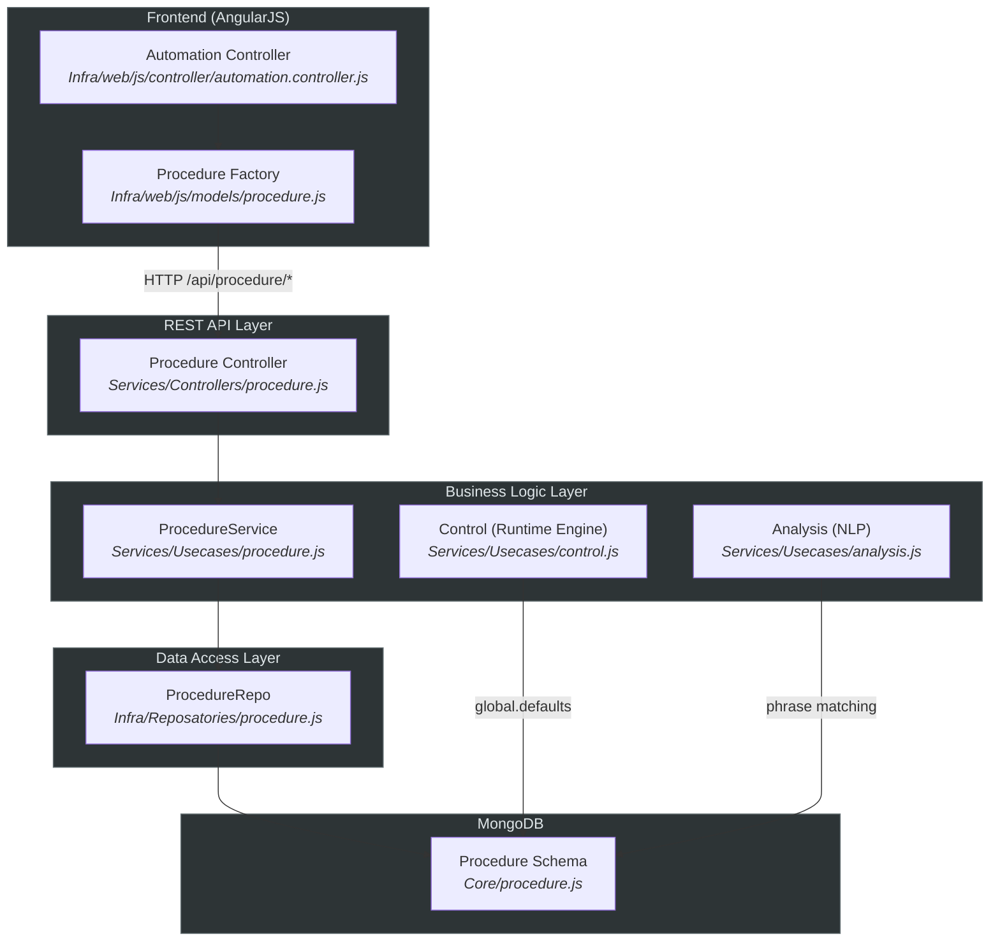

---

## 2. Data Model — Mongoose Schema

**File:** procedure.js

**MongoDB Collection:** `procedures`

### 2.1 Schema Fields

| # | Field | Type | Default | Description |
| --- | --- | --- | --- | --- |
| 1 | `name` | `String` | — | Human-readable procedure name (e.g., "Welcome", "Sales Flow") |
| 2 | `entryPointName` | `String` | — | Name of the entry-point step where execution begins |
| 3 | `description` | `String` | — | Free-text description for admin UI |
| 4 | `personalization` | `Object` | — | Template personalization data (key-value pairs injected into messages) |
| 5 | `personalizationSyncState` | `Object` | `{}` | Tracks sync state per key: `{keyName: true/false}` for O(1) access |
| 6 | `type` | `String` | — | Procedure type classifier |
| 7 | `repeat` | `Number` | — | Max repeat count for steps before triggering `failStep` |
| 8 | `failStep` | `Object` | — | The fallback step object executed when max repeats are reached |
| 9 | `default` | `Boolean` | — | If `true`, this procedure is the default for its channels |
| 10 | `completedStatuses` | `Array` | `[]` | List of statuses considered "completed" for dispatches |
| 11 | `rejectedSatatuses` | `Array` | `[]` | List of statuses considered "rejected" for dispatches |
| 12 | `channels` | `Array` | `[]` | Channels this procedure serves (e.g., `["whatsapp","facebook"]`) |
| 13 | `supportedLanguages` | `Array` | `[]` | ISO language codes supported by this procedure |
| 14 | `phrases` | `Array<{text, language}>` | `[]` | NLP training phrases used for intention detection |
| 15 | `active` | `Boolean` | `true` | Whether the procedure is active and available at runtime |
| 16 | `outboundProcedure` | `Boolean` | `true` | Whether this procedure can be used for outbound dispatches |
| 17 | `enableAiRecognition` | `Boolean` | `false` | Enables AI-based image/audio recognition on this flow |
| 18 | `autoSwitchFlowLanguageMoonshoot` | `Boolean` | `true` | Auto-switch the Moonshot AI intention based on detected language |
| 19 | `steps` | `Mixed` | — | **The core of the procedure** — an array of step objects defining the conversational flow graph |
| 20 | `entryPointIndex` | `Number` | `0` | Index of the entry-point step in the `steps` array |
| 21 | `importId` | `String` | — | External import reference ID |
| 22 | `creationDate` | `Date` | `Date.now` | Auto-set creation timestamp |
| 23 | `priority` | `Number` | `0` | Priority ranking (higher = more important in matching) |
| 24 | `defaultLang` | `String` | `"en-US"` | Default language code for this procedure |
| 25 | `autoDetectLang` | `Boolean` | `false` | Enable automatic language detection |
| 26 | `fromDate` | `Date` | — | Schedule: start date for activation |
| 27 | `toDate` | `Date` | — | Schedule: end date for activation |
| 28 | `fromTime` | `Date` | — | Schedule: daily start time |
| 29 | `toTime` | `Date` | — | Schedule: daily end time |
| 30 | `qc` | `Object` | — | Quality Control configuration (triggers, rules) |
| 31 | `updatedBy` | `String` | — | ID/name of the user who last updated this procedure |

> [!NOTE]
The schema uses `timestamps: true`, which automatically adds `createdAt` and `updatedAt` fields managed by Mongoose.
> 

### 2.2 The `steps` Field — Deep Dive

The `steps` field is typed as `Mixed` (schema-less) and holds an **array of step objects**. Each step represents a node in the conversation flow graph.

```mermaid
graph LR
    subgraph Step["Step Object Structure"]
        direction TB
        N["name: String (unique ID)"]
        T["type: String"]
        M["messages: Array"]
        E["expected: Array of entities"]
        S["success: String (next step)"]
        F["fail: String (next step)"]
        A["action: String (function name)"]
        EF["effect: String (status change)"]
        EX["expiry: {seconds, step}"]
        NX["next: String (next step)"]
        R["repeat: Number (counter)"]
        L["labels: Array"]
        AL["aiLabels: Array"]
        FI["field: String (personalization key)"]
        TM["team: ObjectId"]
        CT["contextTransfer: Object"]
        CD["conditional: Object"]
    end

    style Step fill:#1e272e,stroke:#636e72,color:#dfe6e9
```

**Key step properties:**

| Property | Type | Description |
| --- | --- | --- |
| `name` | `String` | Unique step identifier within the procedure |
| `type` | `String` | Step type — see Step Types Reference |
| `messages` | `Array` | Localized message templates to send to the customer |
| `expected` | `Array` | Entities the system expects the customer to provide |
| `success` | `String` | Name of the next step on success |
| `fail` | `String` | Name of the next step on failure |
| `action` | `String` | Name of the function to execute (from `Actions` class) |
| `effect` | `String` | Status/classification to apply to the conversation |
| `expiry` | `Object` | Timer configuration: `{seconds, step}` — after N seconds, jump to step |
| `next` | `String` | Unconditional next step (used in `break` type) |
| `repeat` | `Number` | Runtime counter for how many times this step has been visited |
| `labels` | `Array` | Labels to attach to the conversation at this step |
| `aiLabels` | `Array` | AI labels to attach |
| `field` | `String` | Personalization key to store extracted data |
| `team` | `ObjectId` | Team to assign the conversation to |
| `conditional` | `Object` | Conditional routing config with regex patterns |
| `contextTransfer` | `Object` | Configuration for transferring context between bots |

---

## 3. Repository Layer — procedure.js

The repository provides raw data-access methods wrapping Mongoose operations.

### 3.1 Methods

| Method | Signature | Description |
| --- | --- | --- |
| `create` | `create(_obj)` | Creates a new procedure document |
| `update` | `update(_findObj, _obj, _project?)` | Updates a procedure using `findOneAndUpdate` (returns updated doc) |
| `updateById` | `updateById(_id, _obj)` | Partial update via `updateOne` with `$set` |
| `delete` | `delete(_findObj)` | Deletes a procedure via `findOneAndRemove` |
| `findOne` | `findOne(_findObj, _project?)` | Finds a single procedure |
| `list` | `list(_findObj?, _project?)` | Lists procedures matching a filter |
| `listPagginated` | `listPagginated(_findObj?, _project?)` | Paginated listing with keyword search and sorting by `creationDate` desc |
| `addPhrase` | `addPhrase(_obj)` | Adds a single training phrase via `$addToSet`; also handles learning model annotation with similarity matching |
| `addPhrases` | `addPhrases(_obj)` | Bulk-adds training phrases via `$addToSet` with `$each` |
| `count` | `count()` | Returns total procedure count |

> [!IMPORTANT]
The `addPhrase` method has side-effects beyond the procedure itself: it updates the **Learning** model to mark similar phrases as `"annotated"`, using configurable similarity thresholds from `global.settings.learningAccuracyPercentage`.
> 

---

## 4. Service / Use-Case Layer — procedure.js

The service layer enforces business rules and coordinates between repositories.

### 4.1 Methods

| Method | Signature | Description |
| --- | --- | --- |
| `create` | `create(_obj)` | Creates a procedure and notifies `eventHub` |
| `update` | `update(_obj, _hasPermission)` | Updates with permission check: **blocks editing active+default procedures** without `SUPERPERMISSION_EDIT_LIVE_PROCEDURE` |
| `updateById` | `updateById(_obj, _hasPermission)` | Partial update with same permission check |
| `list` | `list(_findObj?, _project?)` | Delegates to repo `list` |
| `listPagginated` | `listPagginated(_page, _size, _keyWord)` | Paginated listing with projected fields: `_id name default active outboundProcedure channels` |
| `getProcedure` | `getProcedure(_findObj, _project?)` | Retrieves a single procedure |
| `addPhrase` | `addPhrase(_obj)` | Adds a training phrase and notifies `eventHub` |
| `addPhrases` | `addPhrases(_obj)` | Bulk-adds training phrases and notifies `eventHub` |
| `uploadFile` | `uploadFile(_obj)` | Uploads an attachment file (e.g., audio) via the file hosting factory |
| `downloadAttachment` | `downloadAttachment(fileName)` | Downloads an attachment from the configured file hosting service |
| `findConvProcLastXHours` | `findConvProcLastXHours(_obj)` | Checks if conversations exist in archived or live collections for a procedure |
| `deleteById` | `deleteById(_procId, _period?)` | **Safe delete**: blocks deletion if there are conversations in the last 72 hours (configurable) |
| `replace` | `replace(_obj)` | Merges procedure B into procedure A (keeps A's `_id`, `name`, `active`, `default`; optionally moves channels) |
| `import` | `import(_obj)` | Creates a procedure from an imported JSON object |

### 4.2 Permission Model

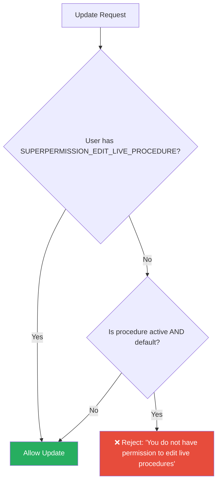

### 4.3 Safe Delete Flow

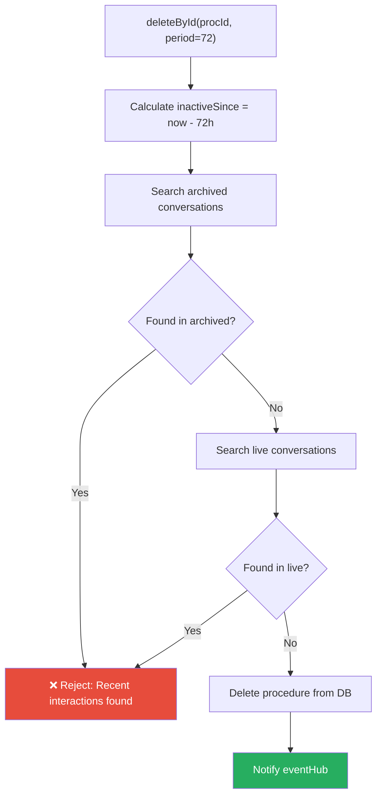

---

## 5. Controller Layer — procedure.js

Mounted automatically by `main.js` at: **`/api/procedure`**

### 5.1 Endpoints

| Method | Route | Description | Auth/Permission |
| --- | --- | --- | --- |
| `POST` | `/` | Create a new procedure | Standard auth |
| `PUT` | `/` | Full update of a procedure | Checks `SUPERPERMISSION_EDIT_LIVE_PROCEDURE` |
| `PATCH` | `/quickAccess` | Partial update (quick access) | Checks `SUPERPERMISSION_EDIT_LIVE_PROCEDURE` |
| `GET` | `/list/:page/:size/:keyWord` | Paginated listing with optional keyword search | Standard auth |
| `GET` | `/` | List all procedures | Standard auth |
| `GET` | `/populated` | List procedures that have QC triggers (returns `_id`, `name`, `qc`) | Standard auth |
| `GET` | `/getAllProcedures` | Get all procedure names (returns `_id`, `name`, `creationDate`) | Standard auth |
| `GET` | `/actions/class-functions` | Lists all available action function names from the `Actions` class | Standard auth |
| `GET` | `/proceduresList` | Get active procedures list (uses `global.defaults` cache if available) | Standard auth |
| `GET` | `/names` | Get procedure summaries with key fields for routing | Standard auth |
| `GET` | `/steps/:id` | Get only the steps of a specific procedure | Standard auth |
| `GET` | `/:id` | Get a single procedure by ID | Standard auth |
| `PUT` | `/phrases` | Add a single training phrase | Standard auth |
| `PUT` | `/phrasesList` | Bulk-add training phrases | Standard auth |
| `POST` | `/uploadFile` | Upload a file attachment | Standard auth |
| `GET` | `/attachement/:url` | Download an attachment file | Standard auth |
| `DELETE` | `/:id` | Delete a procedure (safe delete with 72h check) | Standard auth |
| `PUT` | `/replace` | Replace/merge one procedure into another | Standard auth |
| `POST` | `/import` | Import a procedure from JSON | Standard auth |

---

## 6. Frontend Model — procedure.js

An **AngularJS factory** registered as `Procedure`, providing methods that map 1:1 to the REST API:

| Method | HTTP | Route |
| --- | --- | --- |
| `findOne(_id, cb)` | GET | `/api/procedure/:id` |
| `getSteps(_id, cb)` | GET | `/api/procedure/steps/:id` |
| `update(_data, cb)` | PUT | `/api/procedure` |
| `updateById(_data, cb)` | PATCH | `/api/procedure/quickAccess` |
| `uploadFile(_data, cb)` | POST | `/api/procedure/uploadFile` |
| `create(_data, cb)` | POST | `/api/procedure` |
| `import(_data, cb)` | POST | `/api/procedure/import` |
| `list(_page, _size, _keyword, cb)` | GET | `/api/procedure/list/:page/:size/:keyword` |
| `getAllProcedures(cb)` | GET | `/api/procedure/getAllProcedures` |
| `listProcdrsEntittsProjctd(cb)` | GET | `/api/entity/procedures/entities` |
| `delete(_id, cb)` | DELETE | `/api/procedure/:id` |
| `proceduresList(cb)` | GET | `/api/procedure/proceduresList` |
| `replace(_data, cb)` | PUT | `/api/procedure/replace` |

---

## 7. Runtime Behavior — How Procedures Drive Conversations

### 7.1 Message Lifecycle

When a customer sends a message, the following flow executes:

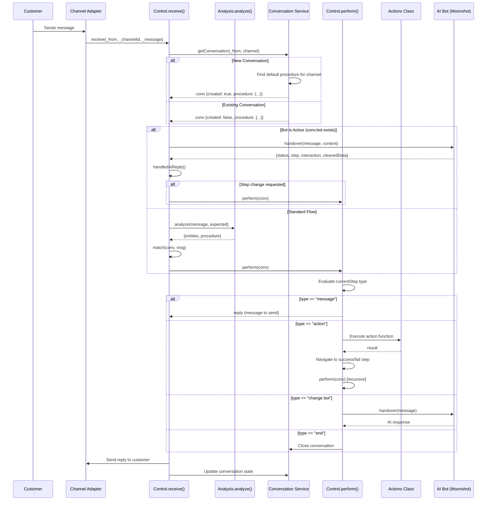

### 7.2 Procedure Selection on New Conversation

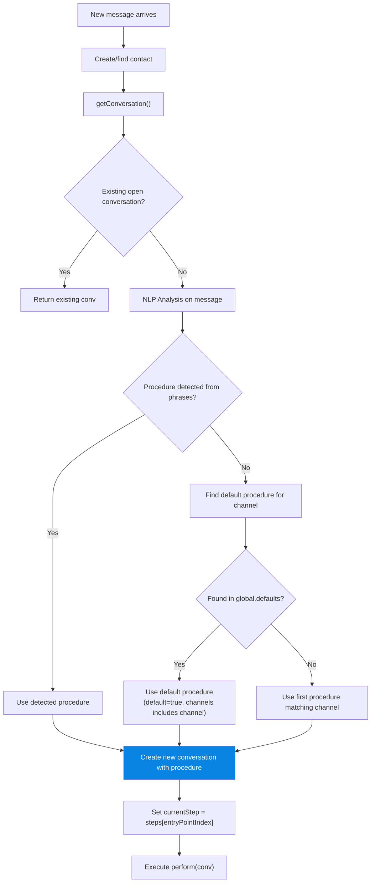

### 7.3 Step Execution Engine — `perform(_conv)`

The `perform` method is the **core execution engine**. It reads `_conv.currentStep.type` and executes accordingly. It is **recursive** — action, conditional, and break steps call `perform` again after navigating to the next step.

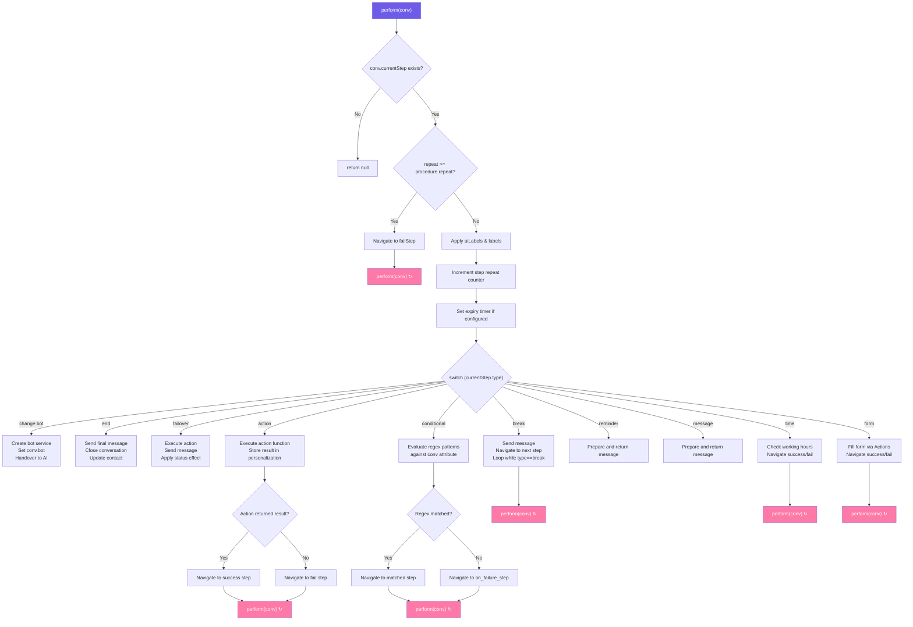

---

## 8. Step Types Reference

| Type | Behavior | Recursive? | Key Properties |
| --- | --- | --- | --- |
| **`message`** | Sends a message and waits for customer input | No | `messages`, `expected`, `effect` |
| **`break`** | Sends a message then immediately continues to the next step (no wait) | Yes | `messages`, `next`, `effect` |
| **`action`** | Executes a server-side function from the Actions class | Yes | `action`, `success`, `fail`, `field`, `effect` |
| **`change bot`** | Hands the conversation to an AI bot (e.g., Moonshot) | Conditional | `name` (bot name), `success`, `fail`, `contextTransfer` |
| **`end`** | Sends an optional final message and closes the conversation | No | `messages`, `effect` |
| **`failover`** | Executes an action and sends a message (used for error recovery) | No | `action`, `messages`, `effect` |
| **`conditional`** | Evaluates regex patterns against a conversation attribute and routes accordingly | Yes | `conditional.selectedAttribute`, `conditional.regex[]`, `conditional.on_failure_step` |
| **`time`** | Checks if the current time is within working hours | Yes | `success`, `fail`, `effect` |
| **`form`** | Fills a form (via ticketing system) and routes based on result | Yes | `action: "fillForm"`, `success`, `fail`, `field` |
| **`reminder`** | Sends a reminder message | No | `messages`, `effect` |

---

## 9. Global Caching & Sync

Procedures are **cached in memory** for performance, since they are read on every incoming message.

### 9.1 Cache Mechanism

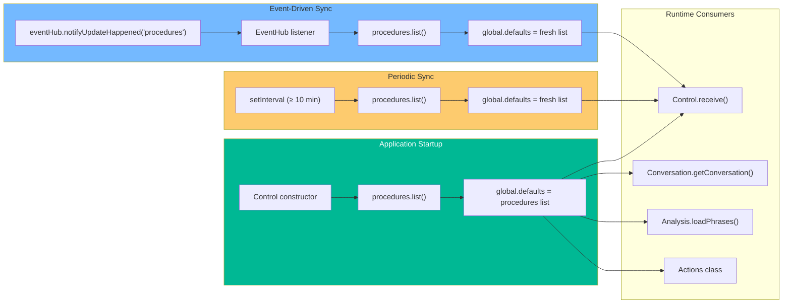

### 9.2 Cache Invalidation Events

The `global.eventHub.notifyUpdateHappened("procedures")` call is triggered by:

- `create()` — new procedure created
- `update()` — procedure updated
- `updateById()` — procedure partially updated
- `addPhrase()` — training phrase added
- `addPhrases()` — training phrases bulk-added
- `deleteById()` — procedure deleted
- `replace()` — procedure merged
- `import()` — procedure imported

---

## 10. Cross-Module Integration Map

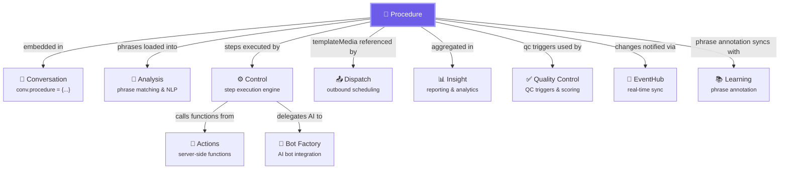

### Integration Details

| Module | Relationship | Details |
| --- | --- | --- |
| **Conversation** | `conv.procedure = {…}` | Every conversation stores a snapshot of its procedure. The `currentStep` pointer tracks execution position. |
| **Analysis** | Phrase matching | Procedure phrases are loaded into `global.phrases[]` and indexed by `PhraseIndex` for fast NLP matching. |
| **Control** | Step execution | The `perform()` engine reads `conv.procedure.steps` and navigates the step graph. |
| **Actions** | Function execution | Steps with `type: "action"` call functions by name from the Actions class (e.g., `actions.fillForm()`). |
| **Dispatch** | Outbound scheduling | Dispatches reference `procedure._id` and `procedure.startStep` for outbound message campaigns. |
| **Insight** | Analytics | `summaryTopProcedures()` aggregates conversation data grouped by procedure. |
| **Bot Factory** | AI integration | Steps with `type: "change bot"` create bot instances and delegate conversation to AI (e.g., Moonshot). |
| **Quality Control** | QC triggers | Procedures with `qc.triggers` are used by the QC module for automated scoring. |
| **EventHub** | Real-time sync | Procedure changes trigger `notifyUpdateHappened("procedures")` which refreshes `global.defaults`. |
| **Learning** | Phrase annotation | When phrases are added, similar entries in the Learning model are auto-annotated. |

---

## 11. API Endpoint Reference

### Quick Reference Table

| # | Method | Endpoint | Request Body/Params | Response |
| --- | --- | --- | --- | --- |
| 1 | `POST` | `/api/procedure` | `{name, steps, channels, ...}` | Created procedure object |
| 2 | `PUT` | `/api/procedure` | `{_id, ...fields}` | Updated procedure object |
| 3 | `PATCH` | `/api/procedure/quickAccess` | `{_id, ...partialFields}` | Update result |
| 4 | `GET` | `/api/procedure/list/:page/:size/:keyWord` | URL params | `{total, data: [...]}` |
| 5 | `GET` | `/api/procedure` | — | `[...all procedures]` |
| 6 | `GET` | `/api/procedure/populated` | — | `[{_id, name, qc}]` |
| 7 | `GET` | `/api/procedure/getAllProcedures` | — | `[{_id, name, creationDate}]` |
| 8 | `GET` | `/api/procedure/actions/class-functions` | — | `["functionName1", ...]` |
| 9 | `GET` | `/api/procedure/proceduresList` | — | `[...active procedures]` |
| 10 | `GET` | `/api/procedure/names` | — | `[{_id, name, personalization, channels, ...}]` |
| 11 | `GET` | `/api/procedure/steps/:id` | URL param: `id` | `{steps: [...]}` |
| 12 | `GET` | `/api/procedure/:id` | URL param: `id` | Full procedure object |
| 13 | `PUT` | `/api/procedure/phrases` | `{docObj, phrase, text, _id}` | Update result |
| 14 | `PUT` | `/api/procedure/phrasesList` | `{docId, phrases: [...]}` | `"phrases added successfully"` |
| 15 | `POST` | `/api/procedure/uploadFile` | `{attachement, contentType, fileType}` | Upload URL |
| 16 | `GET` | `/api/procedure/attachement/:url` | URL param: `url` | Binary file content |
| 17 | `DELETE` | `/api/procedure/:id` | URL param: `id` | `"deleted"` |
| 18 | `PUT` | `/api/procedure/replace` | `{toBeReplacedProc, selectedProc, moveChannels}` | Merged procedure object |
| 19 | `POST` | `/api/procedure/import` | Full procedure JSON | Created procedure object |

> [!WARNING]
The `DELETE` endpoint enforces a **72-hour safety window**. If any conversations used this procedure in the last 72 hours (in either live or archived collections), the deletion will be rejected.
> 

---

# Part II — Entity Module

---

## 12. Entity Architecture Overview

Entities are the **building blocks of NLP understanding** in RoboDesk. While procedures define *what flow to follow*, entities define *what the customer said* and *how to react*. They are the bridge between unstructured customer input and structured step navigation.

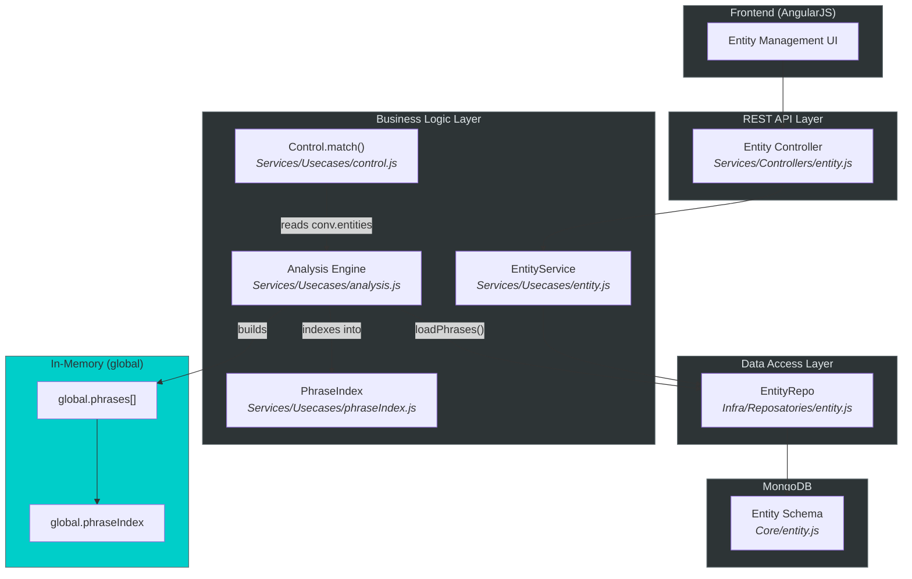

---

## 13. Entity Data Model — Mongoose Schema

**File:** entity.js

**MongoDB Collection:** `entities`

### 13.1 Schema Fields

| # | Field | Type | Default | Required | Description |
| --- | --- | --- | --- | --- | --- |
| 1 | `name` | `String` | — | ✅ | Unique entity name (e.g., `"greeting"`, `"yes"`, `"email"`) — used as the key for matching against `step.expected[]` |
| 2 | `category` | `String` | — | ✅ | Grouping category (e.g., `"intent"`, `"data"`, `"sentiment"`) |
| 3 | `type` | `String` | — |  | Matching type: `"text"` for similarity matching, `"regex"` for regex patterns |
| 4 | `assign` | `String` | `"name"` |  | Which property value to store in personalization: `"name"` (entity name) or `"value"` (original phrase text) |
| 5 | `priority` | `Number` | `0` |  | Priority level — higher priority entities take precedence |
| 6 | `action` | `String` | — |  | Name of an Actions class function to auto-execute when this entity is detected |
| 7 | `sentiment` | `Number` | `0` |  | Sentiment score to apply to the conversation (positive/negative) |
| 8 | `phrases` | `Array<{text, language}>` | `[]` |  | Training phrases for NLP matching — the words/patterns the system looks for |
| 9 | `active` | `Boolean` | `true` |  | Whether this entity is active and included in analysis |
| 10 | `intention` | `Boolean` | `false` |  | If `true`, this entity can change the Moonshot AI intention |
| 11 | `importId` | `String` | — |  | External import reference ID |
| 12 | `creationDate` | `Date` | `Date.now` |  | Auto-set creation timestamp |
| 13 | `isLabel` | `Boolean` | `false` |  | If `true`, when detected the entity name is added as an AI label on the conversation |
| 14 | `isNotify` | `Boolean` | `false` |  | If `true`, triggers a notification to the assigned agent when detected |
| 15 | `notificationText` | `String` | — |  | Custom notification text (used when `isNotify` is true) |
| 16 | `overwritedLabels` | `Array` | `[]` |  | List of AI label names to **remove** from the conversation when this entity is detected |
| 17 | `updatedBy` | `String` | — |  | ID/name of the user who last updated this entity |

> [!NOTE]
Like the Procedure schema, Entity uses `timestamps: true` for auto-managed `createdAt` / `updatedAt`.
> 

### 13.2 Entity vs Procedure Phrases — Key Difference

Both entities and procedures have `phrases` arrays, but they serve different purposes in the NLP pipeline:

| Aspect | Entity Phrases | Procedure Phrases |
| --- | --- | --- |
| **`base` in global.phrases** | `"entity"` | `"procedure"` |
| **Purpose** | Detect customer intent/data within a step | Detect which procedure/conversation flow to use |
| **Effect** | Navigates to a step, stores value in personalization | Changes the active procedure for the conversation |
| **Applied via** | `Control.match()` → `step.expected[]` | `Analysis.analyze()` → procedure detection |
| **Sorting** | By type, then accuracy (strategy-dependent) | First match wins |

---

## 14. Entity Repository Layer

**File:** entity.js

### 14.1 Methods

| Method | Signature | Description |
| --- | --- | --- |
| `create` | `create(_obj)` | Creates a new entity document |
| `update` | `update(_findObj, _obj, _project?)` | Updates an entity via `findOneAndUpdate` |
| `delete` | `delete(_findObj)` | Deletes an entity via `findOneAndRemove` |
| `findOne` | `findOne(_findObj, _project?)` | Finds a single entity |
| `list` | `list(_findObj?, _project?)` | Lists entities matching a filter |
| `listPagginated` | `listPagginated(_findObj?, _project?)` | Paginated listing with keyword search, language filter, and custom sorting |
| `addPhrase` | `addPhrase(_obj)` | Adds a training phrase via `$addToSet`; annotates similar Learning entries |
| `addPhrases` | `addPhrases(_obj)` | Bulk-adds training phrases via `$addToSet` with `$each` |

> [!IMPORTANT]
Just like the Procedure repository, `addPhrase` has a **side-effect**: it queries the Learning model for pending phrases with similar text (using `node-nlp`'s `SimilarSearch.getBestSubstring`) and marks them as `"annotated"` if similarity ≥ `global.settings.learningAccuracyPercentage`.
> 

---

## 15. Entity Service / Use-Case Layer

**File:** entity.js

### 15.1 Methods

| Method | Signature | Description |
| --- | --- | --- |
| `create` | `create(_obj)` | Creates an entity and notifies `eventHub("entities")` |
| `update` | `update(_obj)` | Updates an entity and notifies `eventHub("entities")` |
| `getEntity` | `getEntity(_findObj)` | Retrieves a single entity by filter |
| `list` | `list(_flat)` | If `_flat=true`: returns only entities. If `_flat=false`: returns `{entities, procedures, intents}` — a combined payload for the admin UI |
| `addPhrase` | `addPhrase(_obj)` | Adds a training phrase and notifies `eventHub("entities")` |
| `addPhrases` | `addPhrases(_obj)` | Bulk-adds phrases and notifies `eventHub("entities")` |
| `listPagginated` | `listPagginated(_page, _size, _keyWord, _language, _sort)` | Paginated listing with multi-filter support |
| `project` | `project(_project)` | Lists entities with specific field projection |
| `listProcdrsEntittsProjctd` | `listProcdrsEntittsProjctd()` | Returns projected entities (`_id, name, type, intention`) alongside projected procedures (`_id, name`) — used for step editor dropdowns |
| `deleteEntityById` | `deleteEntityById(_id)` | Deletes an entity and notifies `eventHub("entities")` |
| `updateInMemory` | `updateInMemory()` | Calls `global.anaylsisUsecaseInstance.commit()` to rebuild the in-memory phrase index |

### 15.2 The `list()` Dual-Mode Pattern

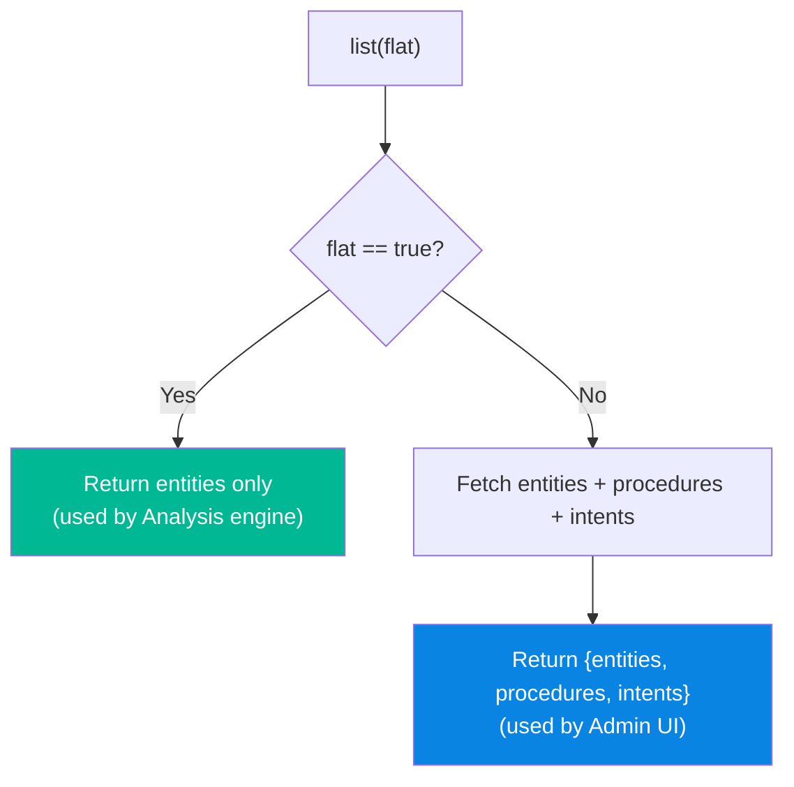

---

## 16. Entity Controller Layer (REST API)

**File:** entity.js

Mounted at: **`/api/entity`**

| Method | Route | Description |
| --- | --- | --- |
| `POST` | `/` | Create a new entity |
| `PUT` | `/` | Update an entity |
| `GET` | `/` | List all entities with procedures and intents (full payload) |
| `GET` | `/flat` | List entities only (flat array) |
| `GET` | `/commit` | **Trigger in-memory phrase index rebuild** — calls `Analysis.commit()` |
| `GET` | `/:id` | Get a single entity by ID |
| `PUT` | `/phrases` | Add a single training phrase |
| `PUT` | `/phrasesList` | Bulk-add training phrases |
| `GET` | `/list/:page/:size/:keyWord/:language/:sort` | Paginated listing with filters |
| `POST` | `/projection` | List entities with custom field projection |
| `GET` | `/procedures/entities` | Get projected entities + procedures (for UI dropdowns) |
| `DELETE` | `/:id` | Delete an entity |

> [!TIP]
The `/commit` endpoint is critical after bulk entity/phrase changes. It triggers `Analysis.commit()` which reloads all entities and procedures from DB and rebuilds the `PhraseIndex`.
> 

---

## 17. NLP Analysis Engine — How Entities Are Detected

The Analysis engine is the **brain** that connects customer messages to entities. It lives in analysis.js and uses three key components.

### 17.1 Phrase Loading Pipeline

At startup (and on each `commit()`), the Analysis engine loads all entities and procedures into memory:

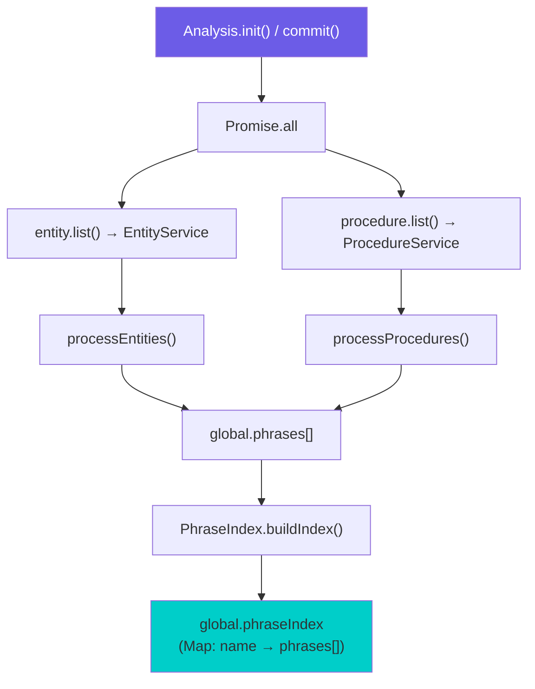

**Entity phrase structure in `global.phrases[]`:**

```jsx
{
    base: "entity",           // Discriminator: "entity" vs "procedure"
    phrase: "hello",           // The text to match against (sanitized)
    language: "en-US",         // Phrase language
    category: "intent",        // Entity category
    name: "greeting",          // Entity name — KEY for step.expected[] matching
    intention: false,           // Can change AI intention?
    assign: "name",            // What value to store: "name" or "value"
    value: "hello",            // Original phrase text (before sanitization)
    type: "text",              // "text" (similarity) or "regex" (pattern)
    sentiment: 0,              // Sentiment score
    isLabel: false,            // Add as AI label?
    priority: 0,               // Entity priority
    action: null,              // Auto-execute action name
    isNotify: false,           // Trigger notification?
    notificationText: null,    // Notification text
    overwritedLabels: [],      // Labels to remove
}
```

### 17.2 PhraseIndex — Fast O(1) Lookup

**File:** phraseIndex.js

The `PhraseIndex` provides an optimized in-memory index using a `Map<name, phrases[]>` for O(1) lookups by entity/procedure name, replacing the previous O(n) full-scan approach.

| Method | Description |
| --- | --- |
| `buildIndex(phrases)` | Builds the Map from the flat `global.phrases[]` array, grouping by `name` |
| `getByName(name)` | Returns all phrases for a single entity/procedure name |
| `getByNames(names)` | Returns phrases for multiple names (used for `step.expected[]` lookups) |
| `getAllPhrases()` | Returns the full phrase array (fallback for open-ended matching) |

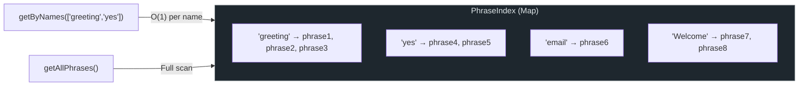

### 17.3 Strategy Pattern — Text Sanitization

The Analysis engine uses a **Strategy Pattern** to handle two modes of text matching, controlled by `global.settings.unsensitizedBotDetection`:

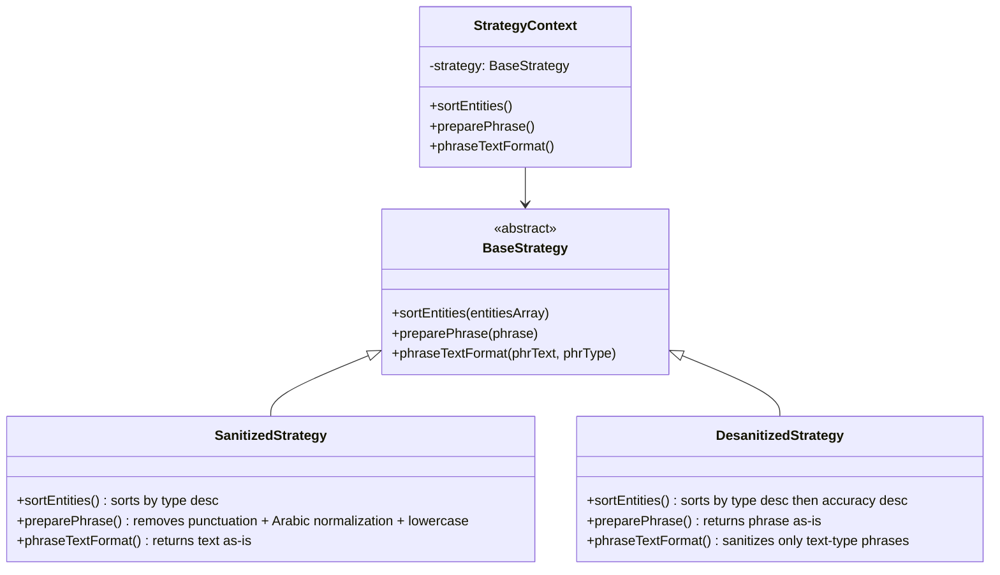

| Strategy | When Used | Phrase Preparation | Entity Sorting |
| --- | --- | --- | --- |
| **SanitizedStrategy** | `unsensitizedBotDetection = false` (default) | Strips `.`, `,`, `?`, `!`, Arabic articles (`ال`), normalizes `ة`→`ه`, lowercase | By `type` descending |
| **DesanitizedStrategy** | `unsensitizedBotDetection = true` | Keeps phrases as-is (raw) | By `type` desc, then `accuracy` desc |

### 17.4 Phrase Matching Algorithm — `#runPhraseMatching()`

This is the core NLP matching function that runs on every customer message:

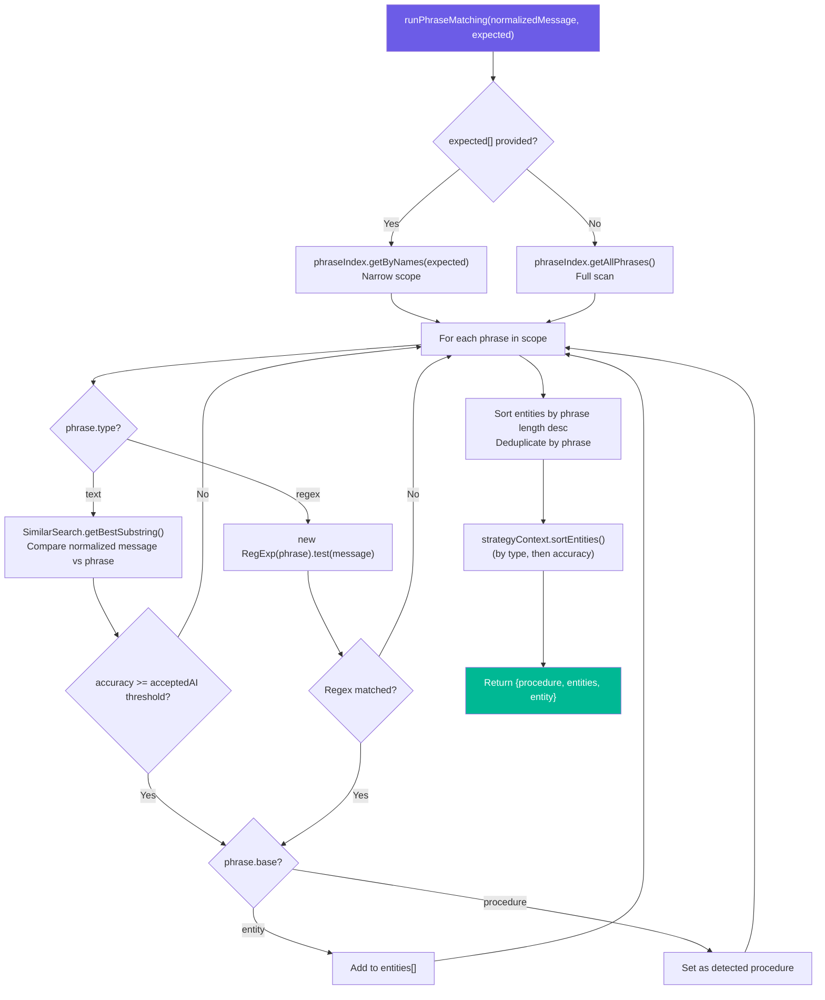

**Key behaviors:**

1. **Scoped matching**: When a step has `expected` entities (via `step.expected[].entity`), only those entity names are checked — dramatically faster than scanning all phrases
2. **Text matching** uses `node-nlp`'s `SimilarSearch.getBestSubstring()` — a fuzzy substring similarity algorithm
3. **Regex matching** uses JavaScript `RegExp.test()` — provides exact pattern matching
4. **Threshold**: A match is accepted only if `accuracy >= global.settings.acceptedAI`
5. **Message normalization**: Messages are truncated to `global.settings.analysisTextSize` characters (default 30), lowercased, punctuation stripped, and Arabic characters normalized

### 17.5 Multi-Type Analysis

The `analyze()` method dispatches based on message type:

| Message Type | Analysis Method | How It Works |
| --- | --- | --- |
| `text`, `reaction` | `textAnalze()` | Direct phrase matching on message text |
| `voice-note-ogg`, `voice-note-mpeg`, `audio` | `audioAnalze()` | Converts audio → text via Google Speech-to-Text, then runs `textAnalze()` |
| `image` | `imageAnalyze()` | Uses AWS Rekognition for label + text detection, then runs `textAnalze()` on combined transcript |
| `location` | `locationAnalyze()` | Runs phrase matching on `"lat,lng"` string |
| Other | — | Returns empty result `{}` |

---

## 18. Entity Runtime Flow — From Detection to Step Navigation

### 18.1 Complete Entity Detection & Consumption Flow

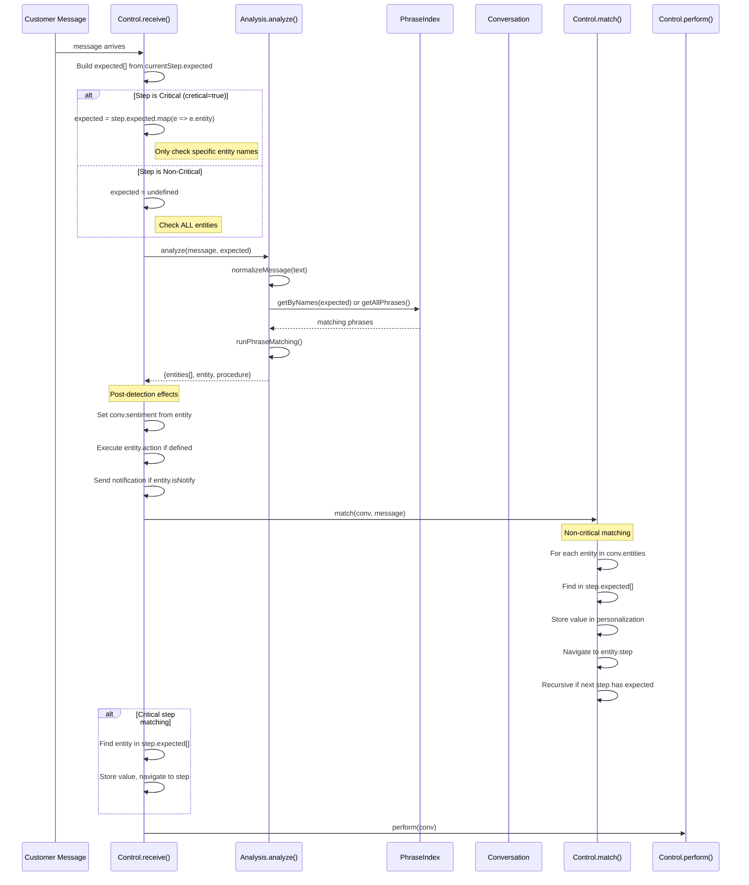

### 18.2 The `match()` Method — Non-Critical Entity Matching

The `match()` method in control.js processes **all accumulated entities** on the conversation against the current step's `expected` list:

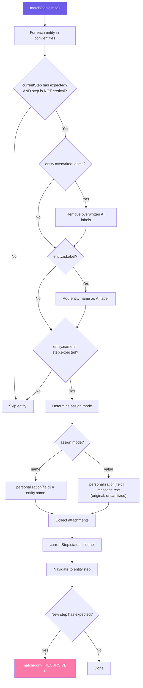

**Key behavior:** The `match()` method is **recursive**. If a matched entity navigates to a new step that also has `expected` entities, it immediately tries to match again using the already-accumulated entities on the conversation. This allows multi-entity extraction in a single message.

### 18.3 Critical vs Non-Critical Steps

Steps have a `cretical` boolean flag that fundamentally changes how entity detection works:

| Aspect | Non-Critical (`cretical: false/undefined`) | Critical (`cretical: true`) |
| --- | --- | --- |
| **Entity scope** | ALL entities are checked (open matching) | Only `step.expected[]` entity names are checked |
| **Matching method** | `match()` iterates `conv.entities` against `step.expected` | Direct check: `step.expected.find(e => e.entity == detected.name)` |
| **Priority handling** | No priority updates | Updates `conv.priority` if entity has higher priority |
| **Attachment handling** | Via `match()` | Direct: stores `message.attachement` in personalization |
| **Use case** | Open-ended questions ("How can I help?") | Specific input required ("What is your email?") |

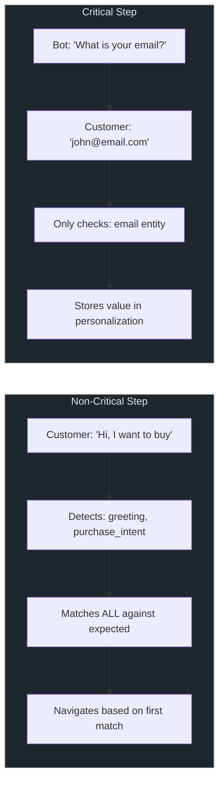

### 18.4 Entity Side-Effects During Detection

When entities are detected, several side-effects are triggered automatically:

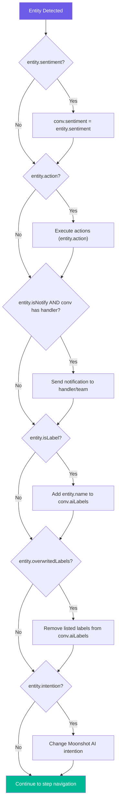

### 18.5 How Entities Connect Procedures to Conversations — The Big Picture

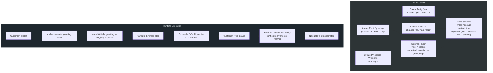

---

## 19. Entity API Endpoint Reference

| # | Method | Endpoint | Request | Response |
| --- | --- | --- | --- | --- |
| 1 | `POST` | `/api/entity` | `{name, category, type, phrases, ...}` | Created entity object |
| 2 | `PUT` | `/api/entity` | `{_id, ...fields}` | Updated entity object |
| 3 | `GET` | `/api/entity` | — | `{entities: [...], procedures: [...], intents: [...]}` |
| 4 | `GET` | `/api/entity/flat` | — | `[...entities only]` |
| 5 | `GET` | `/api/entity/commit` | — | Rebuilds in-memory phrase index |
| 6 | `GET` | `/api/entity/:id` | URL param: `id` | Entity object |
| 7 | `PUT` | `/api/entity/phrases` | `{docObj, phrase, text, _id}` | Update result |
| 8 | `PUT` | `/api/entity/phrasesList` | `{docId, phrases: [...]}` | `"phrases added successfully"` |
| 9 | `GET` | `/api/entity/list/:page/:size/:keyWord/:language/:sort` | URL params | `{total, data: [...]}` |
| 10 | `POST` | `/api/entity/projection` | `["field1", "field2"]` | Projected entity list |
| 11 | `GET` | `/api/entity/procedures/entities` | — | `{_entities: [...], _procedures: [...]}` |
| 12 | `DELETE` | `/api/entity/:id` | URL param: `id` | `"deleted"` |

> [!WARNING]
After bulk entity changes (create/update/delete/add phrases), you should call `GET /api/entity/commit` to rebuild the in-memory phrase index. Without this, NLP matching will use stale data until the next EventHub-triggered rebuild.
> 

---

## File Reference Index

### Procedure Files

| Layer | File | Description |
| --- | --- | --- |
| Schema | Core/procedure.js | Mongoose schema definition |
| Repository | Infra/Reposatories/procedure.js | Data access layer |
| Service | Services/Usecases/procedure.js | Business logic layer |
| Controller | Services/Controllers/procedure.js | REST API endpoints |
| Frontend | Infra/web/js/models/procedure.js | AngularJS factory |

### Entity Files

| Layer | File | Description |
| --- | --- | --- |
| Schema | Core/entity.js | Mongoose schema definition |
| Repository | Infra/Reposatories/entity.js | Data access layer |
| Service | Services/Usecases/entity.js | Business logic layer |
| Controller | Services/Controllers/entity.js | REST API endpoints |

### Shared / Runtime Files