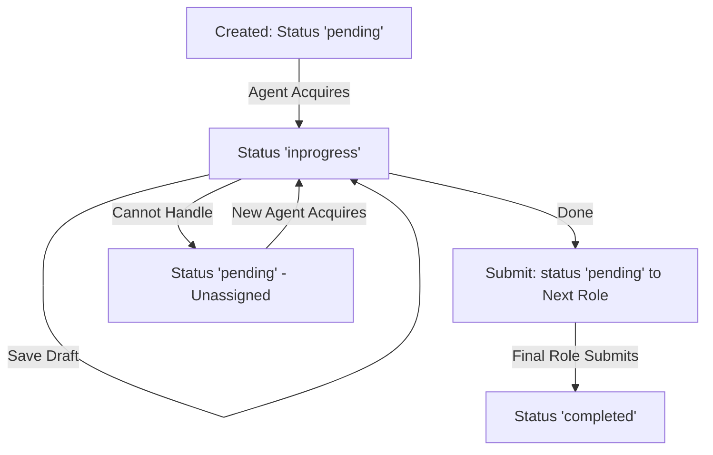

# Robodesk-v3 Ticket System: Technical Deep Dive

This guide provides a comprehensive overview of the ticketing system in Robodesk-v3, designed to help new developers understand its architecture, data models, and workflow mechanics.

## 1. Core Architecture

The ticket system follows a standard **Controller-UseCase-Repository-Model** pattern.

### Layer Breakdown

- **Model (`Core/`)**: [form.run.mode.js]
    - Defines the database schema and indices.
    - Handles auto-incrementing `ticketID` (e.g., `T-1024`).
- **Repository (`Infra/Reposatories/`)**: [form.tickets.js]
    - Contains database-specific queries (Mongoose `find`, `findOneAndUpdate`, etc.).
    - Implements **Optimistic Locking** using the `__v` version field to prevent race conditions.
- **UseCase (`Services/Usecases/`)**: [form.tickets.js]
    - **Business Logic Central**: This is where you'll spend most of your time.
    - Manages status transitions, role-based visibility, and notifications.
- **Controller (`Services/Controllers/`)**: [form.tickets.js]
    - Exposes RESTful endpoints.
    - Handles request validation and formatting.

---

## 2. Understanding Ticket Types

Robodesk-v3 distinguishes between two primary ticket entities:

| Feature | Support Tickets | Form Tickets (Main) |
| --- | --- | --- |
| **Model** | `SupportTicket` | `FormRunMode` |
| **Flexibility** | Fixed Schema | Dynamic (based on Form Builder) |
| **Use Case** | Internal/Cross-domain support | Operational customer requests |
| **Data Storage** | Standard fields | `FormDataFilled` (Array of objects) |

---

## 3. The Data Structure (`FormRunMode`)

The main ticket model combines static **System Fields** with dynamic **User Data**.

### System Fields (Always Present)

- `ticketID`: Unique identifier (e.g., `T-1001`).
- `status`: Current state (`pending`, `inprogress`, `closed`, `rejected`, `drafted`, `hold`).
- `priority`: Escalation level (`low`, `medium`, `high`, `critical`).
- `currentHandler`: Object containing info about the agent currently working the ticket.
- `nextRole`: The department/role responsible for the ticket's current state.
- `timeLine`: A complete audit trail of every status change and update.

### Dynamic Data (`FormDataFilled`)

This is an array that stores the content of the form used to create the ticket. Each element corresponds to a form field (e.g., "Customer Email", "Problem Description").

> [!TIP]
When accessing data from `FormDataFilled` in code, always check for field Existence to avoid runtime errors.
> 

---

## 4. Operational Workflows

The ticket system is a state machine governed by Roles, Users, and Statuses.

### Workflow Visualization

### Key Workflow Actions

| Action | Method Name | Behavior |
| --- | --- | --- |
| **Acquire** | `aquireTicket` | Moves ticket from pool to agent. Status: `pending` → `inprogress`. |
| **Transfer** | `transferTicket` | Hands ticket to a specific agent/role. |
| **Unassign** | `unassignTicket` | Moves ticket back to pool. Status: `inprogress` → `pending`. |
| **Submit** | `submitTicket` | Sends ticket to the next role or closes it. |

### The Rejection Workflow (Supervisor Approval)

If `rejectionWorkflow` is enabled, rejecting a ticket is a two-step process:

1. **Request**: Agent calls `rejectTicket`. Ticket moves to Supervisor Role.
2. **Review**:
    - **Approve** (`approveTicketRejection`): Ticket closed as `rejected`.
    - **Decline** (`declineRejection`): Ticket returns to the original agent with comments.

### Automated Distribution

The `autoDistributionTicket.js` service automatically "pushes" tickets to online agents with relevant roles, eliminating the need for manual acquisition.

---

## 5. Developer Cheat Sheet

### Common Tasks

- **Add a new field to UI list**: Modify the `SYSTEM_TICKET_FIELDS` constant in the UseCase.
- **Change what happens on Submit**: Look at `submitTicket` in the UseCase.
- **Debug a DB issue**: Check the repository methods.

### Rules of Thumb

- **Always update the Timeline**: Every significant change should have a corresponding entry in the `timeLine` array.
- **Check Permissions**: Most ticket actions check for specific ACR (Access Control) permissions like `TKT_VIEW_SUPPORTICKETS` or `TKT_TAKE_ACTION`.
- **Use the QueryBuilder**: For complex searches, utilize the `queryBuilder` helper found in `Infra/Reposatories`.

---

## 6. Key Files Summary

- **Controller**: [Services/Controllers/form.tickets.js]
- **UseCase**: [Services/Usecases/form.tickets.js]
- **Repository**: [Infra/Reposatories/form.tickets.js]
- **Model**: [Core/form.run.mode.js]
