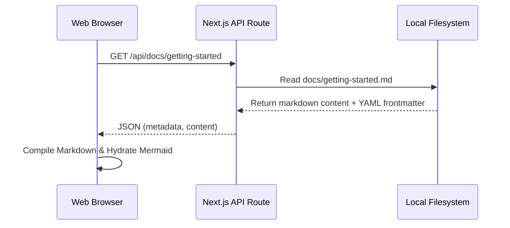

# Getting Started

Welcome to the **Modern Documentation Portal**! This platform is designed to present complex technical documents in a sleek, user-friendly, and interactive environment.

Here, you can easily read, search, edit, and create new document pages.

## ⚡ Core Features

- **Markdown Support**: Full support for standard Markdown features (tables, lists, inline code).
- **Mermaid Diagrams**: Render live diagrams directly from code blocks.
- **Embedded Media**: Embed images, videos, or iframe blocks seamlessly.
- **Dual-Pane Editor**: Edit documents in real-time with a live preview.

---

## 📊 Sample Mermaid Diagram

Here is a sequence diagram showcasing how the documentation portal fetches and compiles markdown content:



---

## 🎨 Rich Styling & Highlighting

We support highlighting important terms to guide your readers. For example, you can use <mark class="accent-highlight">essential concepts</mark> or ==critical details== to make information pop.

Here's an example of standard code highlighting:

```typescript
// Sample function to print a welcome message
function welcomeUser(name: string): string {
  const greeting = `Welcome back, ${name}!`;
  console.log(greeting);
  return greeting;
}
```

---

## 🎥 Embedded Media

### Image Demonstration
Below is a demonstration layout representing the modern portal view:


### Video Demonstration
You can also embed HTML5 videos or custom links:

<video controls width="100%" style="border-radius: 8px; margin-top: 1rem;">
  <source src="https://www.w3schools.com/html/mov_bbb.mp4" type="video/mp4" />
  Your browser does not support the video tag.
</video>
