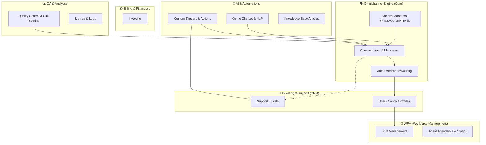

# **RoboDesk-V3 Module Map**

Based on the structure of the database schemas (`/Core`) and the business logic (`/Services`), here is a comprehensive breakdown of the platform’s features and how the repository is organized.

## **Code Separation (Backend vs. Frontend)**

Historically, this repository was a **monorepo** that housed both the backend and the frontend.

- **The Backend (Current Focus):** Most of the code you see (`/Core`, `/Services`, `/Infra/Adapters`) is the Express.js / Node.js backend. It provides the API and WebSocket services.
- **The Frontend (Legacy Angular):** The project previously used `gulp` to compile an older AngularJS frontend. The backend serves static files from the `/Infra/dist` or `/Infra/web` directories. If your team said they “don’t use gulp anymore,” it is very likely that the modern frontend (React, Next.js, or Angular) has been decoupled and moved to a separate GitHub repository, while this codebase now functions exclusively as the headless backend API.

---

## **Feature Modules**

RoboDesk is a large contact center platform. Based on your database models, the platform can be grouped into **six distinct logical modules**:

### **1.Omnichannel Engine (The Heart)**

- **What it does:** Handles all real-time communication coming into the system.
- **Key Files:** `Core/conversation.js`, `Core/message.js`, `Services/Usecases/autoDistribution.js`
- **How it works:** When a message arrives from WhatsApp or a phone call comes in via SIP, the `Adapters` capture it, format it, and pass it to the `AutoDistribution` use case. That use case routes it to an available agent based on skills and capacity.

### **2.Ticketing & Support (CRM)**

- **What it does:** Represents the asynchronous helpdesk side of the application.
- **Key Files:** `Core/supportTicket.js`, `Core/contact.js`
- **How it works:** Manages long-running issues that cannot be resolved instantly in chat. Agents can create tickets, assign statuses, and track resolutions. Customer profiles (`contacts`) are linked to these tickets.

### **3.Billing ("Pelling") & Financials**

- **What it does:** Handles invoicing, likely for SaaS subscriptions or billable support hours.
- **Key Files:** `Core/invoice.js`
- **How it works:** Generates and tracks invoices for end clients based on service usage or subscriptions.

### **4.Workforce Management (WFM)**

- **What it does:** Manages agents’ working hours.
- **Key Files:** `Core/shiftmgt.js`, `Core/attendance.js`, `Core/swapRequest.js`
- **How it works:** A core contact-center capability that tracks clock-in and clock-out activity, manages assigned shifts, and allows agents to request shift swaps with colleagues.

### **5.AI, Knowledge, and Automations**

- **What it does:** Deflects tickets and automates repetitive tasks.
- **Key Files:** `/Genie/` folder, `Core/knowledgeBase.js`, `Core/triggerSchema.js`, `Core/action.js`
- **How it works:** The platform includes a built-in rule engine (`Commander`). You can define triggers (for example, “If a VIP customer opens a ticket”) to launch actions (for example, “Send an SMS to the manager”). It also hosts Knowledge Base articles that the AI chatbot can reference.

### **6.QA & Reporting**

- **What it does:** Evaluates agent performance.
- **Key Files:** `Core/qualityControl.js`, `Core/report.js`
- **How it works:** Managers can review closed conversations and calls and score them using custom Quality Control criteria to ensure the contact center maintains high standards.
